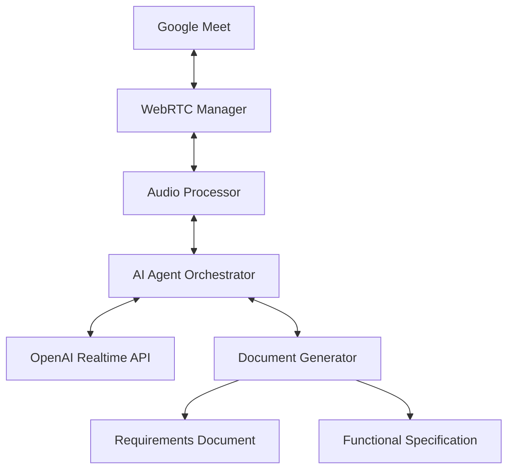

# WebRTC System Development Consultation Agent

Google Meetに参加してシステム開発相談を行い、要件定義書や機能仕様書を自動生成するAIエージェントです。

## 🎯 プロジェクト概要

このプロジェクトは、WebRTCとOpenAI Realtime APIを活用して、Google Meet会議に「システム開発相談Agent」として参加し、リアルタイムで要求開発相談を行うアプリケーションです。

### 主な機能
- 🤖 Google Meet会議への自動参加
- 💬 リアルタイム音声対話による開発相談
- 📋 要件ヒアリングと整理
- 📄 要件定義書の自動生成
- 📊 機能仕様書の自動生成（Mermaid/PlantUML図表付き）

## 🏗️ アーキテクチャ



## 🚀 クイックスタート

### 前提条件
- Node.js 20+
- Docker & Docker Compose
- VS Code (DevContainer使用時)

### DevContainer での開発
```bash
# リポジトリのクローン
git clone https://github.com/your-username/webrtc-agent.git
cd webrtc-agent

# VS CodeでDevContainerを開く
code .
# Command Palette で "Dev Containers: Reopen in Container" を実行
```

### Docker での開発
```bash
# 環境変数設定
cp .env.example .env
# .envファイルを編集してAPIキーを設定

# 開発環境起動
docker-compose -f environment/docker/docker-compose.yml up -d

# ログ確認
docker-compose -f environment/docker/docker-compose.yml logs -f webrtc-agent
```

## 📁 プロジェクト構成

```
webrtc-agent/
├── src/                    # ソースコード
│   ├── core/              # コアモジュール
│   ├── agents/            # 専門エージェント
│   ├── services/          # 外部サービス統合
│   ├── utils/             # ユーティリティ
│   └── types/             # TypeScript型定義
├── doc/                   # ドキュメント
│   ├── specifications/    # 仕様書
│   ├── architecture/      # アーキテクチャドキュメント
│   └── api/              # API仕様書
├── environment/           # 環境設定
│   ├── docker/           # Docker設定
│   └── devcontainer/     # DevContainer設定
├── tests/                # テスト
│   ├── unit/             # ユニットテスト
│   ├── integration/      # 統合テスト
│   └── e2e/              # E2Eテスト
└── .github/              # GitHub設定
    ├── workflows/        # CI/CD
    └── ISSUE_TEMPLATE/   # Issue テンプレート
```

## 🔧 開発ガイド

### 環境変数
```bash
# OpenAI設定
OPENAI_API_KEY=your_api_key
OPENAI_MODEL=gpt-4o-realtime-preview-2024-10-01

# Google Meet設定
GOOGLE_CLIENT_ID=your_client_id
GOOGLE_CLIENT_SECRET=your_client_secret

# その他の設定は .env.example を参照
```

### スクリプト
```bash
npm run dev        # 開発サーバー起動
npm run build      # プロダクションビルド
npm run test       # テスト実行
npm run lint       # コード検査
npm run format     # コードフォーマット
```

## 📚 ドキュメント

- [仕様書](doc/specifications/SPECIFICATIONS.md)
- [アーキテクチャ](doc/architecture/)
- [API仕様](doc/api/)
- [開発ガイド](doc/development-guide.md)

## 🤝 コントリビューション

1. このリポジトリをフォーク
2. feature ブランチを作成 (`git checkout -b feature/AmazingFeature`)
3. 変更をコミット (`git commit -m 'Add some AmazingFeature'`)
4. ブランチにプッシュ (`git push origin feature/AmazingFeature`)
5. Pull Request を作成

## 📄 ライセンス

このプロジェクトは MIT ライセンスの下で公開されています。詳細は [LICENSE](LICENSE) ファイルを参照してください。

## ⚠️ 注意事項

- このプロジェクトは実験的なものです
- Google Meet の利用規約を遵守してください
- 音声データは一時的に処理されるのみで永続化されません
- 商用利用時は各種APIの利用規約を確認してください
