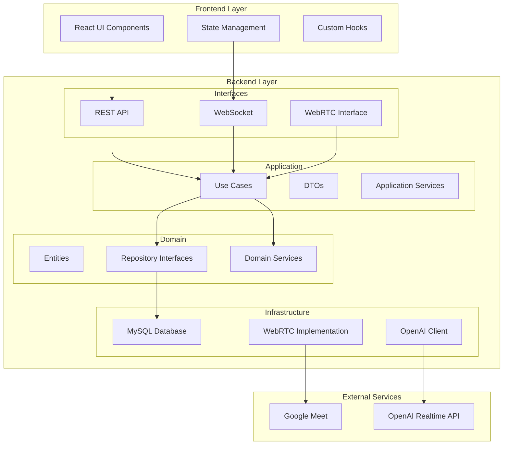
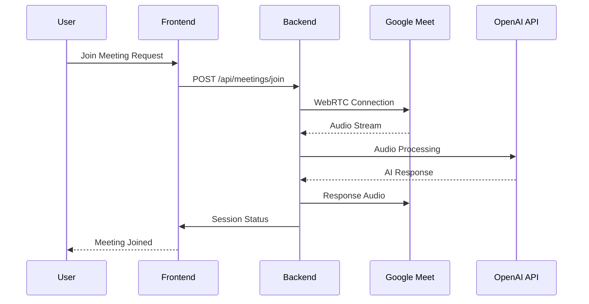

# WebRTC System Development Consultation Agent

Google Meetに参加してシステム開発相談を行い、要件定義書や機能仕様書を自動生成するAIエージェントです。

## 🎯 プロジェクト概要

このプロジェクトは、WebRTCとOpenAI Realtime APIを活用して、Google Meet会議に「システム開発相談Agent」として参加し、リアルタイムで要求開発相談を行うアプリケーションです。

### 主な機能
- 🤖 Google Meet会議への自動参加
- 💬 リアルタイム音声対話による開発相談
- 📋 要件ヒアリングと整理
- 📄 要件定義書の自動生成
- 📊 機能仕様書の自動生成（Mermaid/PlantUML図表付き）

## 🏗️ アーキテクチャ

### システム全体構成


### データフロー


## 🚀 クイックスタート

### 前提条件
- Node.js 20+
- Bun 1.0+
- Docker & Docker Compose
- VS Code (DevContainer使用時)

### DevContainer での開発
```bash
# リポジトリのクローン
git clone https://github.com/your-username/webrtc-agent.git
cd webrtc-agent

# VS CodeでDevContainerを開く
code .
# Command Palette で "Dev Containers: Reopen in Container" を実行
```

### Docker での開発
```bash
# 環境変数設定
cp .env.example .env
# .envファイルを編集してAPIキーを設定

# 開発環境起動 (Docker Compose)
docker compose up -d

# Docker Bakeでビルド
make build

# Makefileコマンド使用
make dev          # 開発環境起動
make dev-logs     # ログ確認
make dev-stop     # 環境停止
```

### ローカル開発
```bash
# 依存関係インストール
bun install

# 開発サーバー起動
bun run dev

# フロントエンドのみ起動
bun run dev:frontend

# バックエンドのみ起動
bun run dev:backend
```

## 📁 プロジェクト構成

```
webrtc-agent/
├── src/                           # ソースコード
│   ├── frontend/                  # フロントエンド (React + TypeScript)
│   │   ├── components/           # UIコンポーネント
│   │   ├── pages/                # ページコンポーネント
│   │   ├── hooks/                # カスタムフック
│   │   ├── stores/               # 状態管理
│   │   ├── utils/                # フロントエンド用ユーティリティ
│   │   └── types/                # フロントエンド型定義
│   ├── backend/                   # バックエンド (Node.js + TypeScript)
│   │   ├── domain/               # ドメイン層
│   │   │   ├── entities/         # エンティティ
│   │   │   ├── repositories/     # リポジトリインターフェース
│   │   │   └── services/         # ドメインサービス
│   │   ├── application/          # アプリケーション層
│   │   │   ├── usecases/         # ユースケース
│   │   │   ├── dtos/             # データ転送オブジェクト
│   │   │   └── services/         # アプリケーションサービス
│   │   ├── infrastructure/       # インフラストラクチャ層
│   │   │   ├── database/         # データベース実装
│   │   │   ├── webrtc/           # WebRTC実装
│   │   │   ├── external/         # 外部API連携
│   │   │   └── config/           # 設定管理
│   │   └── interfaces/           # インターフェース層
│   │       ├── controllers/      # コントローラー
│   │       ├── middlewares/      # ミドルウェア
│   │       ├── routes/           # ルーティング
│   │       └── websocket/        # WebSocket処理
│   └── shared/                    # 共通モジュール
│       ├── types/                # 共通型定義
│       ├── utils/                # 共通ユーティリティ
│       └── constants/            # 定数定義
├── tests/                         # テスト
│   ├── frontend/                 # フロントエンドテスト
│   │   ├── components/           # コンポーネントテスト
│   │   ├── pages/                # ページテスト
│   │   ├── hooks/                # フックテスト
│   │   └── stores/               # ストアテスト
│   ├── backend/                  # バックエンドテスト
│   │   ├── domain/               # ドメイン層テスト
│   │   ├── application/          # アプリケーション層テスト
│   │   ├── infrastructure/       # インフラ層テスト
│   │   └── interfaces/           # インターフェース層テスト
│   ├── shared/                   # 共通モジュールテスト
│   ├── bdd/                      # BDDテスト
│   │   ├── features/             # Gherkinフィーチャーファイル
│   │   └── step-definitions/     # ステップ定義
│   └── e2e/                      # E2Eテスト (Playwright)
│       ├── fixtures/             # テストフィクスチャ
│       └── tests/                # E2Eテストケース
├── doc/                          # ドキュメント
│   ├── specifications/           # 仕様書
│   ├── architecture/             # アーキテクチャドキュメント
│   │   ├── clean-architecture.md  # クリーンアーキテクチャ
│   │   ├── bdd-test-strategy.md   # BDDテスト戦略
│   │   └── database-design.md     # データベース設計
│   └── api/                      # API仕様書
├── environment/                  # 環境設定
│   ├── docker/                   # Docker設定
│   └── devcontainer/             # DevContainer設定
└── .github/                      # GitHub設定
    ├── workflows/                # CI/CD
    └── ISSUE_TEMPLATE/           # Issueテンプレート
```

## 🔧 開発ガイド

### 環境変数
```bash
# OpenAI設定
OPENAI_API_KEY=your_api_key
OPENAI_MODEL=gpt-4o-realtime-preview-2024-10-01

# Google Meet設定
GOOGLE_CLIENT_ID=your_client_id
GOOGLE_CLIENT_SECRET=your_client_secret

# その他の設定は .env.example を参照
```

### スクリプト
```bash
bun run dev        # 開発サーバー起動 (Frontend + Backend)
bun run build      # プロダクションビルド
bun run test       # テスト実行
bun run lint       # コード検査
bun run format     # コードフォーマット
bun run type-check # 型チェック
```

### 詳細なスクリプト
```bash
# 開発
bun run dev:frontend    # Viteフロントエンド開発サーバー
bun run dev:backend     # バックエンド開発サーバー

# ビルド
bun run build:frontend  # フロントエンドビルド
bun run build:backend   # バックエンドビルド

# テスト
bun run test:unit       # ユニットテスト (Vitest)
bun run test:integration # 統合テスト
bun run test:e2e        # E2Eテスト (Playwright)
bun run test:bdd        # BDDテスト

# データベース
bun run db:migrate      # マイグレーション実行
bun run db:seed         # シードデータ投入
bun run db:reset        # データベースリセット

# Docker Bake
make build              # 全イメージビルド
make build-app          # アプリケーションイメージのみ
make build-frontend     # フロントエンドイメージのみ
make build-backend      # バックエンドイメージのみ
make build-prod         # 本番用イメージビルド
```

## 🐳 Docker Bake

### 利用可能なターゲット
- `app`: メインアプリケーション
- `frontend`: フロントエンドのみ
- `backend`: バックエンドのみ
- `devcontainer`: 開発コンテナ
- `test`: テスト用イメージ
- `production`: 本番最適化イメージ

### 使用例
```bash
# 基本ビルド
docker buildx bake

# 特定のターゲット
docker buildx bake frontend backend

# プッシュ付きビルド
docker buildx bake --push

# 環境変数指定
REGISTRY=ghcr.io IMAGE_NAME=myorg/webrtc-agent docker buildx bake
```

## 📚 ドキュメント

- [仕様書](doc/specifications/SPECIFICATIONS.md)
- [クリーンアーキテクチャ設計](doc/architecture/clean-architecture.md)
- [BDDテスト戦略](doc/architecture/bdd-test-strategy.md)
- [データベース設計](doc/architecture/database-design.md)
- [API仕様](doc/api/)

## 🧪 テスト戦略

### テストピラミッド
- **E2Eテスト**: Playwrightによる完全なユーザージャーニー
- **統合テスト**: レイヤー間の連携テスト
- **ユニットテスト**: 各レイヤーの単体テスト
- **BDDテスト**: Gherkinによる振る舞い駆動テスト

### 実行コマンド
```bash
bun run test:unit       # ユニットテスト (Vitest)
bun run test:integration # 統合テスト (Jest)
bun run test:e2e        # E2Eテスト (Playwright)
bun run test:bdd        # BDDテスト (Jest + Cucumber)
```

## ⚡ 技術スタック

### フロントエンド
- **React 18** + **TypeScript**
- **Vite** (高速ビルドツール)
- **Vitest** (ユニットテスト)
- **Material-UI** (UIコンポーネント)
- **Zustand** (状態管理)

### バックエンド
- **Node.js 20** + **TypeScript**
- **NestJS** (フレームワーク)
- **MySQL 8.0** (データベース)
- **Socket.IO** (WebSocket)

### 開発ツール
- **Bun** (高速パッケージマネージャ・ランタイム)
- **Docker Bake** (マルチターゲットビルド)
- **Docker Compose** (ローカル開発環境)
- **Playwright** (E2Eテスト)
- **Jest** + **Cucumber** (BDDテスト)
- **ESLint** + **Prettier** (コード品質)
- **Makefile** (開発タスク自動化)

## 🤝 コントリビューション

1. このリポジトリをフォーク
2. feature ブランチを作成 (`git checkout -b feature/AmazingFeature`)
3. 変更をコミット (`git commit -m 'Add some AmazingFeature'`)
4. ブランチにプッシュ (`git push origin feature/AmazingFeature`)
5. Pull Request を作成

## 📄 ライセンス

このプロジェクトは MIT ライセンスの下で公開されています。詳細は [LICENSE](LICENSE) ファイルを参照してください。

## ⚠️ 注意事項

- このプロジェクトは実験的なものです
- Google Meet の利用規約を遵守してください
- 音声データは一時的に処理されるのみで永続化されません
- 商用利用時は各種APIの利用規約を確認してください
