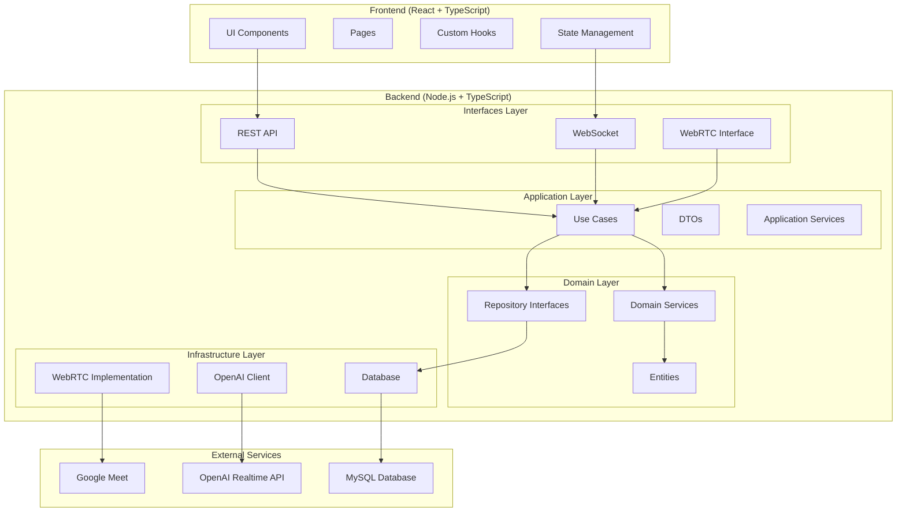
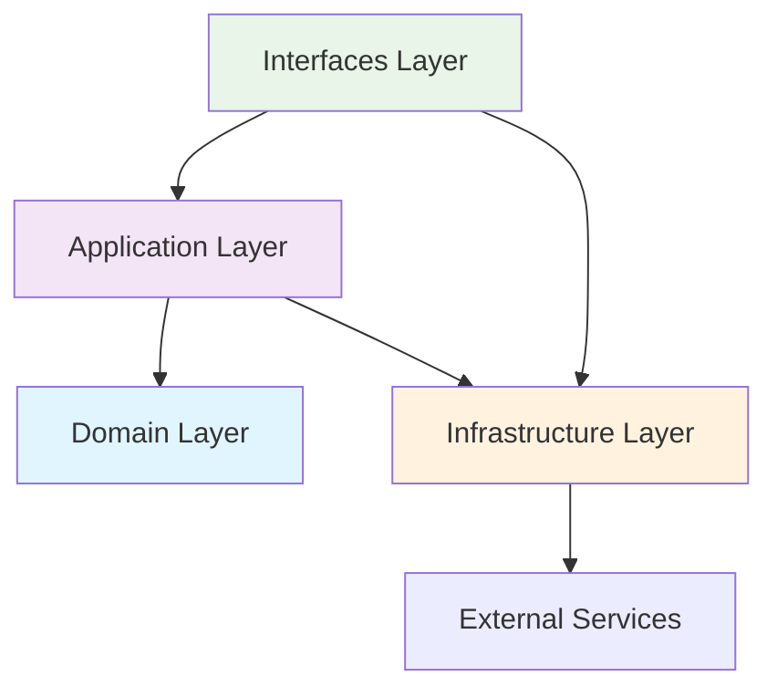
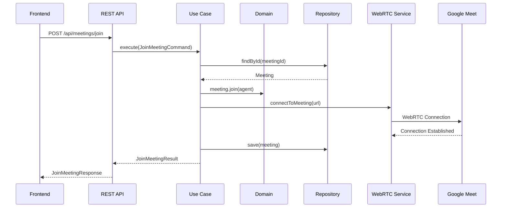
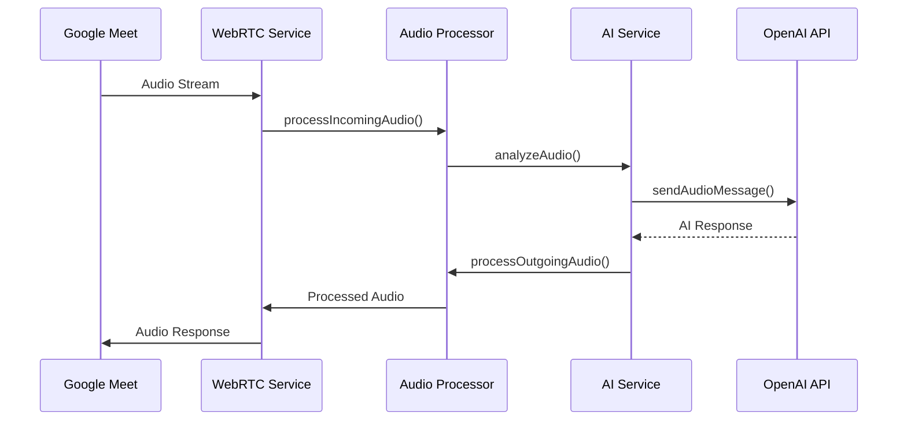
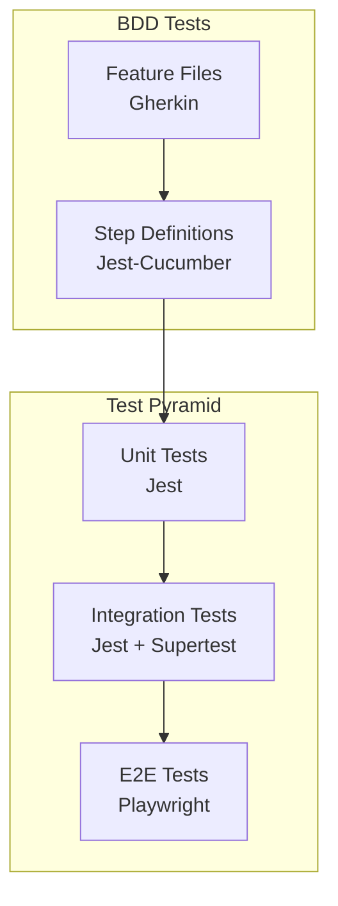

# クリーンアーキテクチャ設計書

## 1. アーキテクチャ概要

### 1.1 全体構成



### 1.2 依存性の方向



## 2. レイヤー詳細設計

### 2.1 Domain Layer (ドメイン層)

#### 責務
- ビジネスロジックの中核
- エンティティとドメインサービス
- 外部依存なし

#### 構成
```typescript
// Entities
export class Meeting {
  constructor(
    private readonly id: MeetingId,
    private readonly url: string,
    private readonly participants: Participant[],
    private status: MeetingStatus
  ) {}

  public join(agent: Agent): void {
    this.validateJoinConditions(agent);
    this.participants.push(new Participant(agent));
    this.status = MeetingStatus.ACTIVE;
  }

  private validateJoinConditions(agent: Agent): void {
    if (this.status !== MeetingStatus.WAITING) {
      throw new DomainError('Meeting is not available for joining');
    }
  }
}

export class ConsultationSession {
  constructor(
    private readonly id: SessionId,
    private readonly meeting: Meeting,
    private readonly requirements: Requirement[],
    private status: SessionStatus
  ) {}

  public addRequirement(requirement: Requirement): void {
    this.requirements.push(requirement);
  }

  public generateSpecification(): Specification {
    return new Specification(this.requirements);
  }
}

// Domain Services
export class RequirementAnalysisService {
  public analyzeConversation(conversation: Conversation): Requirement[] {
    // ビジネスロジック実装
  }
}

// Repository Interfaces
export interface MeetingRepository {
  save(meeting: Meeting): Promise<void>;
  findById(id: MeetingId): Promise<Meeting | null>;
  findActive(): Promise<Meeting[]>;
}

export interface ConsultationRepository {
  save(session: ConsultationSession): Promise<void>;
  findByMeetingId(meetingId: MeetingId): Promise<ConsultationSession | null>;
}
```

### 2.2 Application Layer (アプリケーション層)

#### 責務
- ユースケースの実装
- DTOによるデータ変換
- トランザクション管理

#### 構成
```typescript
// Use Cases
export class JoinMeetingUseCase {
  constructor(
    private readonly meetingRepository: MeetingRepository,
    private readonly webrtcService: WebRTCService,
    private readonly eventBus: EventBus
  ) {}

  public async execute(command: JoinMeetingCommand): Promise<JoinMeetingResult> {
    // 1. ドメインオブジェクト取得
    const meeting = await this.meetingRepository.findById(command.meetingId);
    if (!meeting) {
      throw new MeetingNotFoundError(command.meetingId);
    }

    // 2. ドメインロジック実行
    const agent = new Agent(command.agentConfig);
    meeting.join(agent);

    // 3. インフラストラクチャ操作
    await this.webrtcService.connectToMeeting(meeting.getUrl());

    // 4. 永続化
    await this.meetingRepository.save(meeting);

    // 5. イベント発行
    this.eventBus.publish(new MeetingJoinedEvent(meeting.getId()));

    return new JoinMeetingResult(meeting.getId(), agent.getId());
  }
}

export class ConsultationUseCase {
  constructor(
    private readonly consultationRepository: ConsultationRepository,
    private readonly requirementAnalysisService: RequirementAnalysisService,
    private readonly documentGenerationService: DocumentGenerationService
  ) {}

  public async processConversation(
    command: ProcessConversationCommand
  ): Promise<ProcessConversationResult> {
    // ビジネスロジック実装
  }
}

// DTOs
export class JoinMeetingCommand {
  constructor(
    public readonly meetingId: string,
    public readonly agentConfig: AgentConfigDto
  ) {}
}

export class JoinMeetingResult {
  constructor(
    public readonly meetingId: string,
    public readonly agentId: string
  ) {}
}
```

### 2.3 Infrastructure Layer (インフラストラクチャ層)

#### 責務
- 外部システムとの通信
- データベースアクセス
- 技術的な実装詳細

#### 構成
```typescript
// Database Implementation
export class MySQLMeetingRepository implements MeetingRepository {
  constructor(private readonly connection: Connection) {}

  public async save(meeting: Meeting): Promise<void> {
    const query = `
      INSERT INTO meetings (id, url, status, created_at, updated_at)
      VALUES (?, ?, ?, NOW(), NOW())
      ON DUPLICATE KEY UPDATE
      status = VALUES(status), updated_at = NOW()
    `;

    await this.connection.execute(query, [
      meeting.getId().value,
      meeting.getUrl(),
      meeting.getStatus()
    ]);
  }

  public async findById(id: MeetingId): Promise<Meeting | null> {
    const query = 'SELECT * FROM meetings WHERE id = ?';
    const [rows] = await this.connection.execute(query, [id.value]);

    if (Array.isArray(rows) && rows.length > 0) {
      return this.toDomainEntity(rows[0]);
    }

    return null;
  }

  private toDomainEntity(row: any): Meeting {
    // データベース行からドメインエンティティへの変換
  }
}

// WebRTC Implementation
export class WebRTCServiceImpl implements WebRTCService {
  private peerConnection: RTCPeerConnection;

  public async connectToMeeting(meetingUrl: string): Promise<void> {
    // WebRTC接続実装
  }

  public async sendAudio(audioData: AudioBuffer): Promise<void> {
    // 音声送信実装
  }

  public onAudioReceived(callback: (audio: AudioBuffer) => void): void {
    // 音声受信イベント処理
  }
}

// External API Client
export class OpenAIRealtimeClient implements RealtimeAPIService {
  constructor(private readonly apiKey: string) {}

  public async sendAudioMessage(audio: AudioBuffer): Promise<AudioBuffer> {
    // OpenAI Realtime API呼び出し
  }
}
```

### 2.4 Interfaces Layer (インターフェース層)

#### 責務
- 外部からのリクエスト受付
- レスポンス形成
- 認証・認可

#### 構成
```typescript
// REST API Controllers
@Controller('/api/meetings')
export class MeetingController {
  constructor(
    private readonly joinMeetingUseCase: JoinMeetingUseCase,
    private readonly leaveMeetingUseCase: LeaveMeetingUseCase
  ) {}

  @Post('/join')
  public async joinMeeting(@Body() request: JoinMeetingRequest): Promise<JoinMeetingResponse> {
    const command = new JoinMeetingCommand(request.meetingId, request.agentConfig);
    const result = await this.joinMeetingUseCase.execute(command);

    return new JoinMeetingResponse(result.meetingId, result.agentId);
  }

  @Post('/:meetingId/leave')
  public async leaveMeeting(@Param('meetingId') meetingId: string): Promise<void> {
    const command = new LeaveMeetingCommand(meetingId);
    await this.leaveMeetingUseCase.execute(command);
  }
}

// WebSocket Handlers
@WebSocketGateway()
export class ConsultationGateway {
  @SubscribeMessage('audio-message')
  public async handleAudioMessage(
    @MessageBody() data: AudioMessageData,
    @ConnectedSocket() client: Socket
  ): Promise<void> {
    // リアルタイム音声処理
  }

  @SubscribeMessage('conversation-update')
  public async handleConversationUpdate(
    @MessageBody() data: ConversationUpdateData
  ): Promise<void> {
    // 会話更新処理
  }
}
```

## 3. データフロー

### 3.1 会議参加フロー



### 3.2 音声処理フロー



## 4. エラーハンドリング戦略

### 4.1 エラー分類

```typescript
// Domain Errors
export abstract class DomainError extends Error {
  constructor(message: string) {
    super(message);
    this.name = this.constructor.name;
  }
}

export class MeetingNotFoundError extends DomainError {
  constructor(meetingId: string) {
    super(`Meeting not found: ${meetingId}`);
  }
}

export class InvalidMeetingStateError extends DomainError {
  constructor(currentState: string, expectedState: string) {
    super(`Invalid meeting state. Current: ${currentState}, Expected: ${expectedState}`);
  }
}

// Application Errors
export class ApplicationError extends Error {
  constructor(message: string, public readonly cause?: Error) {
    super(message);
    this.name = this.constructor.name;
  }
}

// Infrastructure Errors
export class InfrastructureError extends Error {
  constructor(message: string, public readonly cause?: Error) {
    super(message);
    this.name = this.constructor.name;
  }
}
```

### 4.2 エラーハンドリングミドルウェア

```typescript
@Catch()
export class GlobalExceptionFilter implements ExceptionFilter {
  catch(exception: unknown, host: ArgumentsHost) {
    const ctx = host.switchToHttp();
    const response = ctx.getResponse<Response>();

    if (exception instanceof DomainError) {
      response.status(400).json({
        error: 'Domain Error',
        message: exception.message,
        code: exception.constructor.name
      });
    } else if (exception instanceof ApplicationError) {
      response.status(500).json({
        error: 'Application Error',
        message: exception.message,
        code: exception.constructor.name
      });
    } else {
      response.status(500).json({
        error: 'Internal Server Error',
        message: 'An unexpected error occurred'
      });
    }
  }
}
```

## 5. テスト戦略

### 5.1 テストピラミッド



### 5.2 テスト分類

- **Unit Tests**: 各レイヤーの単体テスト
- **Integration Tests**: レイヤー間の統合テスト
- **E2E Tests**: フロントエンドからバックエンドまでの完全なフロー
- **BDD Tests**: ビジネス要件に基づく振る舞いテスト

## 6. パフォーマンス考慮事項

### 6.1 音声処理最適化
- AudioWorkletによるリアルタイム処理
- バッファリング戦略
- 適応的品質制御

### 6.2 データベース最適化
- インデックス戦略
- コネクションプール
- クエリ最適化

### 6.3 スケーラビリティ
- 水平スケーリング対応
- ロードバランシング
- キャッシュ戦略