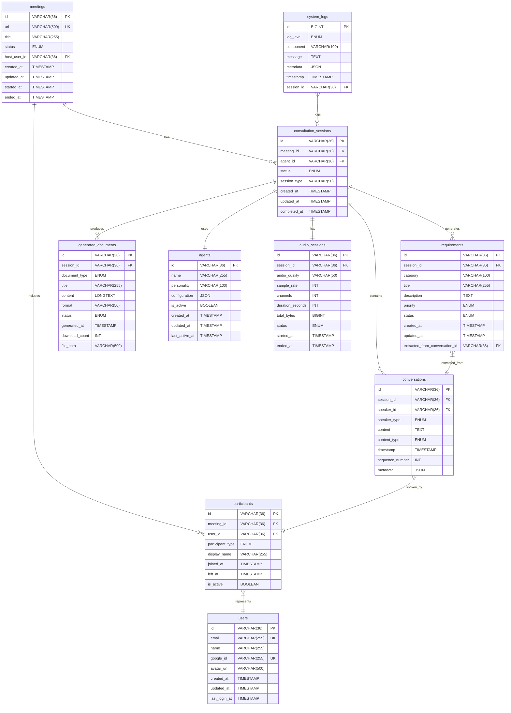

# MySQL データベース設計書

## 1. データベース概要

### 1.1 設計方針
- 正規化: 第3正規形まで適用
- インデックス戦略: 高頻度クエリの最適化
- パーティショニング: 大容量テーブルの分割
- レプリケーション: 読み書き分離対応

### 1.2 データベース構成


## 2. テーブル詳細設計

### 2.1 meetings テーブル
```sql
CREATE TABLE meetings (
    id VARCHAR(36) PRIMARY KEY DEFAULT (UUID()),
    url VARCHAR(500) NOT NULL UNIQUE,
    title VARCHAR(255),
    status ENUM('waiting', 'active', 'ended', 'cancelled') NOT NULL DEFAULT 'waiting',
    host_user_id VARCHAR(36),
    created_at TIMESTAMP DEFAULT CURRENT_TIMESTAMP,
    updated_at TIMESTAMP DEFAULT CURRENT_TIMESTAMP ON UPDATE CURRENT_TIMESTAMP,
    started_at TIMESTAMP NULL,
    ended_at TIMESTAMP NULL,

    INDEX idx_status (status),
    INDEX idx_created_at (created_at),
    INDEX idx_host_user_id (host_user_id),
    FOREIGN KEY (host_user_id) REFERENCES users(id) ON DELETE SET NULL
) ENGINE=InnoDB DEFAULT CHARSET=utf8mb4 COLLATE=utf8mb4_unicode_ci;
```

### 2.2 consultation_sessions テーブル
```sql
CREATE TABLE consultation_sessions (
    id VARCHAR(36) PRIMARY KEY DEFAULT (UUID()),
    meeting_id VARCHAR(36) NOT NULL,
    agent_id VARCHAR(36) NOT NULL,
    status ENUM('initializing', 'active', 'paused', 'completed', 'failed') NOT NULL DEFAULT 'initializing',
    session_type VARCHAR(50) NOT NULL DEFAULT 'development_consultation',
    created_at TIMESTAMP DEFAULT CURRENT_TIMESTAMP,
    updated_at TIMESTAMP DEFAULT CURRENT_TIMESTAMP ON UPDATE CURRENT_TIMESTAMP,
    completed_at TIMESTAMP NULL,

    INDEX idx_meeting_id (meeting_id),
    INDEX idx_agent_id (agent_id),
    INDEX idx_status (status),
    INDEX idx_created_at (created_at),
    FOREIGN KEY (meeting_id) REFERENCES meetings(id) ON DELETE CASCADE,
    FOREIGN KEY (agent_id) REFERENCES agents(id) ON DELETE RESTRICT
) ENGINE=InnoDB DEFAULT CHARSET=utf8mb4 COLLATE=utf8mb4_unicode_ci;
```

### 2.3 participants テーブル
```sql
CREATE TABLE participants (
    id VARCHAR(36) PRIMARY KEY DEFAULT (UUID()),
    meeting_id VARCHAR(36) NOT NULL,
    user_id VARCHAR(36) NULL,
    participant_type ENUM('human', 'agent') NOT NULL,
    display_name VARCHAR(255) NOT NULL,
    joined_at TIMESTAMP DEFAULT CURRENT_TIMESTAMP,
    left_at TIMESTAMP NULL,
    is_active BOOLEAN NOT NULL DEFAULT TRUE,

    INDEX idx_meeting_id (meeting_id),
    INDEX idx_user_id (user_id),
    INDEX idx_participant_type (participant_type),
    INDEX idx_is_active (is_active),
    FOREIGN KEY (meeting_id) REFERENCES meetings(id) ON DELETE CASCADE,
    FOREIGN KEY (user_id) REFERENCES users(id) ON DELETE SET NULL
) ENGINE=InnoDB DEFAULT CHARSET=utf8mb4 COLLATE=utf8mb4_unicode_ci;
```

### 2.4 conversations テーブル
```sql
CREATE TABLE conversations (
    id VARCHAR(36) PRIMARY KEY DEFAULT (UUID()),
    session_id VARCHAR(36) NOT NULL,
    speaker_id VARCHAR(36) NOT NULL,
    speaker_type ENUM('human', 'agent') NOT NULL,
    content TEXT NOT NULL,
    content_type ENUM('text', 'audio_transcript', 'system_message') NOT NULL DEFAULT 'text',
    timestamp TIMESTAMP DEFAULT CURRENT_TIMESTAMP,
    sequence_number INT NOT NULL,
    metadata JSON NULL,

    INDEX idx_session_id (session_id),
    INDEX idx_speaker_id (speaker_id),
    INDEX idx_timestamp (timestamp),
    INDEX idx_sequence_number (sequence_number),
    INDEX idx_content_type (content_type),
    FOREIGN KEY (session_id) REFERENCES consultation_sessions(id) ON DELETE CASCADE,
    FOREIGN KEY (speaker_id) REFERENCES participants(id) ON DELETE CASCADE,

    UNIQUE KEY uk_session_sequence (session_id, sequence_number)
) ENGINE=InnoDB DEFAULT CHARSET=utf8mb4 COLLATE=utf8mb4_unicode_ci;
```

### 2.5 requirements テーブル
```sql
CREATE TABLE requirements (
    id VARCHAR(36) PRIMARY KEY DEFAULT (UUID()),
    session_id VARCHAR(36) NOT NULL,
    category VARCHAR(100) NOT NULL,
    title VARCHAR(255) NOT NULL,
    description TEXT NOT NULL,
    priority ENUM('low', 'medium', 'high', 'critical') NOT NULL DEFAULT 'medium',
    status ENUM('identified', 'clarified', 'approved', 'rejected') NOT NULL DEFAULT 'identified',
    created_at TIMESTAMP DEFAULT CURRENT_TIMESTAMP,
    updated_at TIMESTAMP DEFAULT CURRENT_TIMESTAMP ON UPDATE CURRENT_TIMESTAMP,
    extracted_from_conversation_id VARCHAR(36) NULL,

    INDEX idx_session_id (session_id),
    INDEX idx_category (category),
    INDEX idx_priority (priority),
    INDEX idx_status (status),
    INDEX idx_created_at (created_at),
    FOREIGN KEY (session_id) REFERENCES consultation_sessions(id) ON DELETE CASCADE,
    FOREIGN KEY (extracted_from_conversation_id) REFERENCES conversations(id) ON DELETE SET NULL,

    FULLTEXT KEY ft_title_description (title, description)
) ENGINE=InnoDB DEFAULT CHARSET=utf8mb4 COLLATE=utf8mb4_unicode_ci;
```

### 2.6 generated_documents テーブル
```sql
CREATE TABLE generated_documents (
    id VARCHAR(36) PRIMARY KEY DEFAULT (UUID()),
    session_id VARCHAR(36) NOT NULL,
    document_type ENUM('requirements_specification', 'functional_specification', 'technical_specification', 'architecture_diagram') NOT NULL,
    title VARCHAR(255) NOT NULL,
    content LONGTEXT NOT NULL,
    format VARCHAR(50) NOT NULL DEFAULT 'markdown',
    status ENUM('generating', 'completed', 'failed') NOT NULL DEFAULT 'generating',
    generated_at TIMESTAMP DEFAULT CURRENT_TIMESTAMP,
    download_count INT NOT NULL DEFAULT 0,
    file_path VARCHAR(500) NULL,

    INDEX idx_session_id (session_id),
    INDEX idx_document_type (document_type),
    INDEX idx_status (status),
    INDEX idx_generated_at (generated_at),
    FOREIGN KEY (session_id) REFERENCES consultation_sessions(id) ON DELETE CASCADE,

    FULLTEXT KEY ft_title_content (title, content)
) ENGINE=InnoDB DEFAULT CHARSET=utf8mb4 COLLATE=utf8mb4_unicode_ci;
```

### 2.7 agents テーブル
```sql
CREATE TABLE agents (
    id VARCHAR(36) PRIMARY KEY DEFAULT (UUID()),
    name VARCHAR(255) NOT NULL,
    personality VARCHAR(100) NOT NULL DEFAULT 'professional_consultant',
    configuration JSON NOT NULL,
    is_active BOOLEAN NOT NULL DEFAULT TRUE,
    created_at TIMESTAMP DEFAULT CURRENT_TIMESTAMP,
    updated_at TIMESTAMP DEFAULT CURRENT_TIMESTAMP ON UPDATE CURRENT_TIMESTAMP,
    last_active_at TIMESTAMP NULL,

    INDEX idx_name (name),
    INDEX idx_personality (personality),
    INDEX idx_is_active (is_active),
    INDEX idx_last_active_at (last_active_at)
) ENGINE=InnoDB DEFAULT CHARSET=utf8mb4 COLLATE=utf8mb4_unicode_ci;
```

### 2.8 users テーブル
```sql
CREATE TABLE users (
    id VARCHAR(36) PRIMARY KEY DEFAULT (UUID()),
    email VARCHAR(255) NOT NULL UNIQUE,
    name VARCHAR(255) NOT NULL,
    google_id VARCHAR(255) UNIQUE,
    avatar_url VARCHAR(500) NULL,
    created_at TIMESTAMP DEFAULT CURRENT_TIMESTAMP,
    updated_at TIMESTAMP DEFAULT CURRENT_TIMESTAMP ON UPDATE CURRENT_TIMESTAMP,
    last_login_at TIMESTAMP NULL,

    INDEX idx_email (email),
    INDEX idx_google_id (google_id),
    INDEX idx_last_login_at (last_login_at)
) ENGINE=InnoDB DEFAULT CHARSET=utf8mb4 COLLATE=utf8mb4_unicode_ci;
```

### 2.9 audio_sessions テーブル
```sql
CREATE TABLE audio_sessions (
    id VARCHAR(36) PRIMARY KEY DEFAULT (UUID()),
    session_id VARCHAR(36) NOT NULL UNIQUE,
    audio_quality VARCHAR(50) NOT NULL DEFAULT 'medium',
    sample_rate INT NOT NULL DEFAULT 48000,
    channels INT NOT NULL DEFAULT 1,
    duration_seconds INT NOT NULL DEFAULT 0,
    total_bytes BIGINT NOT NULL DEFAULT 0,
    status ENUM('initializing', 'active', 'completed', 'failed') NOT NULL DEFAULT 'initializing',
    started_at TIMESTAMP DEFAULT CURRENT_TIMESTAMP,
    ended_at TIMESTAMP NULL,

    INDEX idx_session_id (session_id),
    INDEX idx_status (status),
    INDEX idx_started_at (started_at),
    FOREIGN KEY (session_id) REFERENCES consultation_sessions(id) ON DELETE CASCADE
) ENGINE=InnoDB DEFAULT CHARSET=utf8mb4 COLLATE=utf8mb4_unicode_ci;
```

### 2.10 system_logs テーブル (パーティション対応)
```sql
CREATE TABLE system_logs (
    id BIGINT AUTO_INCREMENT PRIMARY KEY,
    log_level ENUM('debug', 'info', 'warn', 'error', 'fatal') NOT NULL,
    component VARCHAR(100) NOT NULL,
    message TEXT NOT NULL,
    metadata JSON NULL,
    timestamp TIMESTAMP DEFAULT CURRENT_TIMESTAMP,
    session_id VARCHAR(36) NULL,

    INDEX idx_log_level (log_level),
    INDEX idx_component (component),
    INDEX idx_timestamp (timestamp),
    INDEX idx_session_id (session_id),
    FOREIGN KEY (session_id) REFERENCES consultation_sessions(id) ON DELETE SET NULL
) ENGINE=InnoDB DEFAULT CHARSET=utf8mb4 COLLATE=utf8mb4_unicode_ci
PARTITION BY RANGE (UNIX_TIMESTAMP(timestamp)) (
    PARTITION p_current VALUES LESS THAN (UNIX_TIMESTAMP('2024-01-01')),
    PARTITION p_2024_q1 VALUES LESS THAN (UNIX_TIMESTAMP('2024-04-01')),
    PARTITION p_2024_q2 VALUES LESS THAN (UNIX_TIMESTAMP('2024-07-01')),
    PARTITION p_2024_q3 VALUES LESS THAN (UNIX_TIMESTAMP('2024-10-01')),
    PARTITION p_2024_q4 VALUES LESS THAN (UNIX_TIMESTAMP('2025-01-01')),
    PARTITION p_future VALUES LESS THAN MAXVALUE
);
```

## 3. インデックス戦略

### 3.1 主要クエリパターン

#### 会議検索
```sql
-- 頻繁に実行されるクエリ
SELECT * FROM meetings WHERE status = 'active';
SELECT * FROM meetings WHERE host_user_id = ? ORDER BY created_at DESC;

-- 最適化インデックス
CREATE INDEX idx_meetings_status_created ON meetings(status, created_at);
CREATE INDEX idx_meetings_host_status ON meetings(host_user_id, status);
```

#### セッション検索
```sql
-- 頻繁に実行されるクエリ
SELECT * FROM consultation_sessions WHERE meeting_id = ? AND status = 'active';
SELECT * FROM consultation_sessions WHERE agent_id = ? ORDER BY created_at DESC LIMIT 10;

-- 最適化インデックス
CREATE INDEX idx_sessions_meeting_status ON consultation_sessions(meeting_id, status);
CREATE INDEX idx_sessions_agent_created ON consultation_sessions(agent_id, created_at);
```

#### 会話履歴検索
```sql
-- 頻繁に実行されるクエリ
SELECT * FROM conversations WHERE session_id = ? ORDER BY sequence_number;
SELECT * FROM conversations WHERE session_id = ? AND speaker_type = 'human' ORDER BY timestamp DESC;

-- 最適化インデックス
CREATE INDEX idx_conversations_session_sequence ON conversations(session_id, sequence_number);
CREATE INDEX idx_conversations_session_speaker_timestamp ON conversations(session_id, speaker_type, timestamp);
```

### 3.2 複合インデックス設計原則
1. **カーディナリティの高い列を先頭に**
2. **WHERE句で頻繁に使用される列を優先**
3. **ORDER BY句を考慮した列順序**

## 4. パフォーマンス最適化

### 4.1 クエリ最適化

#### 効率的な要件抽出
```sql
-- 最適化前
SELECT r.*, c.content
FROM requirements r
JOIN conversations c ON r.extracted_from_conversation_id = c.id
WHERE r.session_id = ?;

-- 最適化後（インデックス利用）
SELECT r.*, c.content
FROM requirements r
FORCE INDEX (idx_session_id)
JOIN conversations c FORCE INDEX (PRIMARY)
ON r.extracted_from_conversation_id = c.id
WHERE r.session_id = ?;
```

#### 全文検索最適化
```sql
-- 要件検索
SELECT * FROM requirements
WHERE MATCH(title, description) AGAINST('認証 ユーザー' IN BOOLEAN MODE)
AND session_id = ?;

-- ドキュメント検索
SELECT * FROM generated_documents
WHERE MATCH(title, content) AGAINST('+要件定義 +機能仕様' IN BOOLEAN MODE)
AND document_type = 'requirements_specification';
```

### 4.2 ページネーション最適化

#### カーソルベースページネーション
```sql
-- 会話履歴のページング（大量データ対応）
SELECT * FROM conversations
WHERE session_id = ?
AND id > ?  -- カーソル
ORDER BY sequence_number
LIMIT 50;
```

### 4.3 キャッシュ戦略

#### Redis キャッシュ設計
```typescript
// セッション情報キャッシュ
interface CachedSession {
  id: string;
  status: string;
  participantCount: number;
  lastActivity: string;
}

// キャッシュキー設計
const CACHE_KEYS = {
  session: (id: string) => `session:${id}`,
  activeParticipants: (meetingId: string) => `participants:active:${meetingId}`,
  conversationCount: (sessionId: string) => `conversation:count:${sessionId}`,
  requirementsSummary: (sessionId: string) => `requirements:summary:${sessionId}`
};
```

## 5. データ保持ポリシー

### 5.1 データライフサイクル

```sql
-- 自動クリーンアップ用プロシージャ
DELIMITER //
CREATE PROCEDURE CleanupOldData()
BEGIN
    DECLARE done INT DEFAULT FALSE;

    -- 30日以上前の完了済みセッションを削除
    DELETE FROM consultation_sessions
    WHERE status = 'completed'
    AND completed_at < DATE_SUB(NOW(), INTERVAL 30 DAY);

    -- 90日以上前のシステムログを削除
    DELETE FROM system_logs
    WHERE timestamp < DATE_SUB(NOW(), INTERVAL 90 DAY);

    -- 孤立したレコードをクリーンアップ
    DELETE FROM conversations
    WHERE session_id NOT IN (SELECT id FROM consultation_sessions);

END //
DELIMITER ;

-- 自動実行設定
CREATE EVENT IF NOT EXISTS cleanup_old_data
ON SCHEDULE EVERY 1 DAY
STARTS CURRENT_TIMESTAMP
DO CALL CleanupOldData();
```

### 5.2 バックアップ戦略

#### 差分バックアップスクリプト
```bash
#!/bin/bash
# daily-backup.sh

BACKUP_DIR="/backup/mysql"
DATE=$(date +%Y%m%d)
DB_NAME="webrtc_agent"

# 全体バックアップ（週1回）
if [ $(date +%u) -eq 7 ]; then
    mysqldump --single-transaction --routines --triggers \
        $DB_NAME > "$BACKUP_DIR/full_${DATE}.sql"
    gzip "$BACKUP_DIR/full_${DATE}.sql"
fi

# 差分バックアップ（日次）
mysqldump --single-transaction --where="updated_at >= CURDATE()" \
    $DB_NAME meetings consultation_sessions conversations requirements generated_documents \
    > "$BACKUP_DIR/incremental_${DATE}.sql"
gzip "$BACKUP_DIR/incremental_${DATE}.sql"

# 7日以上前のバックアップファイルを削除
find $BACKUP_DIR -name "incremental_*.sql.gz" -mtime +7 -delete
find $BACKUP_DIR -name "full_*.sql.gz" -mtime +30 -delete
```

## 6. セキュリティ考慮事項

### 6.1 データ暗号化

#### テーブル暗号化
```sql
-- 機密データテーブルの暗号化
ALTER TABLE conversations ENCRYPTION='Y';
ALTER TABLE requirements ENCRYPTION='Y';
ALTER TABLE generated_documents ENCRYPTION='Y';
```

#### 列レベル暗号化
```sql
-- 個人情報の暗号化
ALTER TABLE users
ADD COLUMN encrypted_email VARBINARY(500),
ADD COLUMN encryption_key_id INT;

-- 暗号化関数使用例
INSERT INTO users (encrypted_email, encryption_key_id)
VALUES (AES_ENCRYPT('user@example.com', 'encryption_key'), 1);
```

### 6.2 アクセス制御

#### ユーザー権限設定
```sql
-- アプリケーション用ユーザー
CREATE USER 'webrtc_app'@'%' IDENTIFIED BY 'secure_password';
GRANT SELECT, INSERT, UPDATE, DELETE ON webrtc_agent.* TO 'webrtc_app'@'%';

-- 読み取り専用ユーザー（レポート用）
CREATE USER 'webrtc_readonly'@'%' IDENTIFIED BY 'readonly_password';
GRANT SELECT ON webrtc_agent.* TO 'webrtc_readonly'@'%';

-- バックアップ用ユーザー
CREATE USER 'webrtc_backup'@'localhost' IDENTIFIED BY 'backup_password';
GRANT SELECT, LOCK TABLES, SHOW VIEW ON webrtc_agent.* TO 'webrtc_backup'@'localhost';
```

## 7. 監視とメトリクス

### 7.1 パフォーマンス監視

#### 重要メトリクス
```sql
-- スロークエリ監視
SELECT
    DIGEST_TEXT,
    COUNT_STAR,
    AVG_TIMER_WAIT/1000000000 AS avg_time_seconds,
    MAX_TIMER_WAIT/1000000000 AS max_time_seconds
FROM performance_schema.events_statements_summary_by_digest
WHERE AVG_TIMER_WAIT > 1000000000  -- 1秒以上
ORDER BY AVG_TIMER_WAIT DESC
LIMIT 10;

-- テーブルサイズ監視
SELECT
    table_name,
    ROUND(((data_length + index_length) / 1024 / 1024), 2) AS 'Size (MB)',
    table_rows
FROM information_schema.tables
WHERE table_schema = 'webrtc_agent'
ORDER BY (data_length + index_length) DESC;
```

### 7.2 自動アラート

#### PrometheusメトリクスのためのView
```sql
-- アクティブセッション数
CREATE VIEW metrics_active_sessions AS
SELECT COUNT(*) as active_sessions
FROM consultation_sessions
WHERE status = 'active';

-- 1時間あたりの新規会議数
CREATE VIEW metrics_hourly_meetings AS
SELECT
    DATE_FORMAT(created_at, '%Y-%m-%d %H:00:00') as hour,
    COUNT(*) as meeting_count
FROM meetings
WHERE created_at >= DATE_SUB(NOW(), INTERVAL 24 HOUR)
GROUP BY DATE_FORMAT(created_at, '%Y-%m-%d %H:00:00');
```