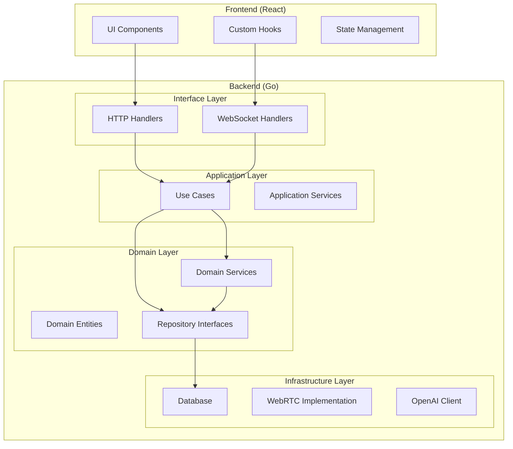

# アーキテクチャ

WebRTC Agent のシステム設計とアーキテクチャについて説明します。

## 概要

本システムは、Clean Architecture の原則に従って設計されており、以下の特徴を持ちます：

- **疎結合**: レイヤー間の依存関係を最小限に抑制
- **テスタビリティ**: 各レイヤーを独立してテスト可能
- **保守性**: ビジネスロジックとインフラストラクチャの分離

## アーキテクチャ構成

## レイヤー詳細

### Interface Layer
- HTTP ハンドラー：REST API のエンドポイント
- WebSocket ハンドラー：リアルタイム通信

### Application Layer
- Use Cases：ビジネスルールの実行
- Application Services：複数の Use Case の組み合わせ

### Domain Layer
- Domain Entities：ビジネスオブジェクト
- Repository Interfaces：データアクセスの抽象化
- Domain Services：ドメインロジック

### Infrastructure Layer
- Database：MySQL + GORM
- WebRTC Implementation：Pion WebRTC
- AI Client：OpenAI Realtime API

## 関連ドキュメント

- [クリーンアーキテクチャ](clean-architecture.md)
- [データベース設計](database-design.md)
- [BDDテスト戦略](bdd-test-strategy.md)