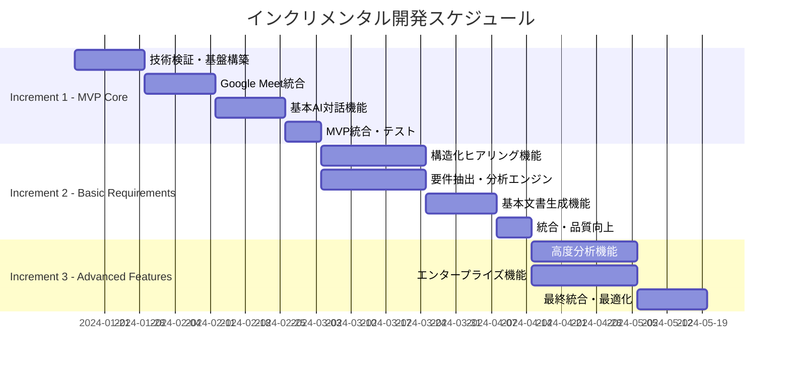

# WebRTC System Development Consultation Agent - インクリメンタル開発計画

## 🎯 インクリメンタル開発戦略概要

### 戦略方針
**「リスク最小化とバリュー最大化を両立するプログレッシブ開発アプローチ」**

- **リスクファースト**：技術的・ビジネス的リスクを早期段階で軽減
- **バリューファースト**：各インクリメントで具体的な顧客価値を提供
- **フィードバック駆動**：早期・頻繁なユーザーフィードバック収集
- **品質ビルトイン**：各段階で品質を作り込み、技術負債を最小化

### 3段階インクリメンタルモデル



---

## 🚀 Increment 1: MVP Core（7週間）

### 目的・価値提案
**「基本的なWebRTC接続とAI対話により、手動要件ヒアリングの50%効率化を実証」**

### スコープ定義

#### 含まれる機能（In Scope）
1. **Google Meet統合**
   - Meet URLからの会議参加
   - 音声ストリーム送受信
   - 基本的な参加者管理
   - 接続状態監視・復旧

2. **基本AI対話**
   - OpenAI Realtime API統合
   - リアルタイム音声認識・応答
   - 会話ログ記録
   - 基本的なエラーハンドリング

3. **初期要件収集**
   - 自然言語での要求聞き取り
   - 基本的な分類・タグ付け
   - 簡単なサマリー生成
   - 会話終了・セッション管理

4. **システム基盤**
   - Go言語バックエンド基盤
   - React フロントエンド基盤
   - MySQL データベース基盤
   - Docker 開発環境

#### 含まれない機能（Out of Scope）
- 複雑な要件分析・構造化
- 高度な文書生成（Mermaid図表等）
- 複数会議システム対応
- エンタープライズ認証・権限管理
- 高度なセキュリティ機能
- スケーラビリティ対応

### 成功指標・受け入れ基準

#### 定量指標
- **機能成功率**: Google Meet参加成功率 95%以上
- **レスポンス性能**: AI応答開始時間 2秒以内
- **音声品質**: 音声認識精度 85%以上
- **可用性**: システム稼働率 95%以上（開発環境）

#### 定性指標
- **ユーザビリティ**: 初回ユーザーが15分以内で基本操作を習得
- **技術検証**: WebRTC・OpenAI API統合の技術的実現可能性証明
- **顧客価値**: 3社以上のパイロット顧客から「有用性」評価取得

### 技術的実装計画

#### Week 1-2: 技術検証・基盤構築
```go
// 主要コンポーネント設計例
type WebRTCManager struct {
    connection *webrtc.PeerConnection
    audioTrack *webrtc.TrackLocalStaticRTP
    meetingID  string
    status     ConnectionStatus
}

type AIAgent struct {
    realtimeClient *openai.RealtimeClient
    conversation   *ConversationLog
    sessionID      string
    state          AgentState
}

type MeetingSession struct {
    id           string
    participants []Participant
    agent        *AIAgent
    webrtc       *WebRTCManager
    startedAt    time.Time
}
```

#### Week 3-4: Google Meet統合
- Pion WebRTC ライブラリ統合
- Meet URL解析・接続処理
- 音声ストリーム管理
- 接続状態監視・自動復旧

#### Week 5-6: AI対話機能
- OpenAI Realtime API クライアント実装
- 音声認識・応答処理
- 会話ログ管理
- 基本的な要求分類機能

#### Week 7: 統合・テスト
- E2Eテスト実装
- パフォーマンス最適化
- バグ修正・品質向上
- デプロイメント準備

### リスク要因・軽減策

#### 高リスク要因
1. **WebRTC技術複雑性**
   - **軽減策**: 早期プロトタイピング、Pion ライブラリ活用
   - **コンティンジェンシー**: WebSocket による音声データ転送代替案

2. **Google Meet非公式統合**
   - **軽減策**: リバースエンジニアリング、コミュニティ知見活用
   - **コンティンジェンシー**: Zoom・Teams 等への切り替え検討

3. **OpenAI API制限・コスト**
   - **軽減策**: API使用量監視、最適化実装
   - **コンティンジェンシー**: 代替AI API（Azure OpenAI）準備

#### 中リスク要因
1. **音声品質・遅延問題**
   - **軽減策**: 音声処理最適化、品質監視実装
   - **コンティンジェンシー**: 音声前処理強化、サーバー側最適化

2. **スケーラビリティ不足**
   - **軽減策**: MVP段階では単一セッション対応に限定
   - **コンティンジェンシー**: Increment 2で本格対応

---

## 📈 Increment 2: Basic Requirements（9週間）

### 目的・価値提案
**「構造化された要件ヒアリングと基本文書生成により、要件定義工数を70%削減」**

### スコープ定義

#### 含まれる機能（In Scope）
1. **構造化ヒアリング**
   - MoSCoW手法による優先度付け
   - 機能・非機能要件の体系的分類
   - ステークホルダー別要求整理
   - 制約条件・リスク要因の特定

2. **要件分析エンジン**
   - 要件間の依存関係分析
   - 妥当性・整合性チェック
   - 抜け漏れ検出・補完提案
   - 工数・コスト概算見積もり

3. **基本文書生成**
   - 要件定義書（構造化Markdown）
   - 機能仕様書（基本項目）
   - 簡易な図表生成（Mermaid）
   - トレーサビリティマトリックス

4. **品質・プロセス改善**
   - 自動テスト環境整備
   - CI/CD パイプライン構築
   - 品質メトリクス監視
   - パフォーマンス最適化

#### 除外機能（Out of Scope）
- 高度なアーキテクチャ分析
- エンタープライズ統合機能
- 多言語対応
- 高度なセキュリティ機能

### 成功指標・受け入れ基準

#### 定量指標
- **要件網羅率**: 90%以上（チェックリストベース）
- **文書品質**: 品質スコア85点以上
- **処理効率**: 要件定義時間を従来の30%まで短縮
- **顧客満足度**: CSAT 80点以上

#### ビジネス指標
- **パイロット顧客**: 5社以上での実証
- **ROI実証**: 1社あたり月50万円以上のコスト削減効果
- **市場検証**: PMF（Product-Market Fit）指標70点以上

### 技術的実装計画

#### Week 1-3: 構造化ヒアリング機能
```go
// 要件分析エンジン設計例
type RequirementAnalyzer struct {
    classifier    *RequirementClassifier
    prioritizer   *MoSCoWPrioritizer
    validator     *RequirementValidator
    estimator     *EffortEstimator
}

type RequirementClassifier struct {
    functionalRules    []ClassificationRule
    nonFunctionalRules []ClassificationRule
    constraintRules    []ClassificationRule
}

type MoSCoWPrioritizer struct {
    mustHaveThreshold    float64
    shouldHaveThreshold  float64
    couldHaveThreshold   float64
    wontHaveThreshold    float64
}
```

#### Week 4-6: 要件分析・検証機能
- 要件間の依存関係グラフ構築
- 矛盾・不整合検出アルゴリズム
- 要件完全性チェック機能
- 工数見積もりモデル実装

#### Week 7-8: 文書生成機能
- テンプレートエンジン実装
- Mermaid図表自動生成
- PDF出力機能
- バージョン管理・変更追跡

#### Week 9: 統合・最適化
- パフォーマンス最適化
- ユーザビリティ改善
- バグ修正・品質向上
- デプロイメント・運用準備

### 主要技術的チャレンジ・解決策

#### チャレンジ1: 自然言語の構造化
- **アプローチ**: NLP技術（spaCy、BERT）とルールベース手法の組み合わせ
- **解決策**: ドメイン特化辞書、意図理解モデルの訓練

#### チャレンジ2: 要件品質保証
- **アプローチ**: 形式検証手法とヒューリスティック検査の組み合わせ
- **解決策**: チェックリストベース検証、統計的品質予測

#### チャレンジ3: リアルタイム処理性能
- **アプローチ**: ストリーミング処理、非同期処理の活用
- **解決策**: Redis キューイング、WebSocket 双方向通信

---

## 🌟 Increment 3: Advanced Features（8週間）

### 目的・価値提案
**「エンタープライズレベルの高度な分析・設計支援により、大規模プロジェクトに対応」**

### スコープ定義

#### 含まれる機能（In Scope）
1. **高度分析機能**
   - AI駆動の要件分析・提案
   - リスク評価・対策立案
   - アーキテクチャ自動設計
   - TCO・ROI 分析

2. **エンタープライズ機能**
   - 複数会議システム対応（Zoom、Teams）
   - エンタープライズ認証（SAML、OAuth2）
   - 高度なセキュリティ機能
   - スケーラビリティ対応

3. **包括的文書生成**
   - 技術仕様書（詳細設計）
   - API仕様書（OpenAPI）
   - テスト仕様書（BDD）
   - デプロイメント文書

4. **運用・保守機能**
   - 監視・ログ管理
   - 自動バックアップ
   - 災害復旧機能
   - パフォーマンス監視

### 成功指標・受け入れ基準

#### 定量指標
- **システム性能**: 同時100セッション対応
- **可用性**: 99.9%以上の稼働率
- **セキュリティ**: セキュリティ監査通過
- **拡張性**: 負荷テスト（10倍トラフィック）合格

#### ビジネス指標
- **エンタープライズ顧客**: 3社以上の大手企業導入
- **売上目標**: 月間売上1000万円達成
- **市場シェア**: 要件定義支援ツール市場でTop 5入り

### 技術アーキテクチャ進化

#### マイクロサービス化
```yaml
# docker-compose.yml (最終形態)
services:
  gateway:
    image: nginx:alpine
    ports: ["80:80", "443:443"]

  webrtc-service:
    build: ./services/webrtc
    scale: 3

  ai-analysis-service:
    build: ./services/ai-analysis
    scale: 2

  document-generation-service:
    build: ./services/document-gen
    scale: 2

  notification-service:
    build: ./services/notification

  database:
    image: mysql:8.0
    deploy:
      replicas: 1

  redis-cluster:
    image: redis:7-alpine
    deploy:
      replicas: 3
```

#### 高可用性・災害復旧
- **データレプリケーション**: MySQL Master-Slave 構成
- **ロードバランシング**: Nginx + Redis セッション共有
- **バックアップ戦略**: 自動日次バックアップ + 3-2-1バックアップ戦略
- **監視・アラート**: Prometheus + Grafana + PagerDuty 連携

### 段階的リリース戦略

#### フェーズ1: プライベートベータ（Week 1-3）
- **対象**: パイロット顧客5社限定
- **機能**: 全機能の80%実装完了
- **目的**: 重要バグ修正、ユーザビリティ改善

#### フェーズ2: オープンベータ（Week 4-6）
- **対象**: 招待制ベータユーザー50社
- **機能**: 全機能実装完了、セキュリティ強化
- **目的**: スケーラビリティ検証、運用プロセス確立

#### フェーズ3: 正式リリース（Week 7-8）
- **対象**: 一般公開、マーケティング開始
- **機能**: 製品版品質、サポート体制完備
- **目的**: 市場投入、成長拡大

---

## 📊 インクリメンタル成功管理

### KPI測定・評価体制

#### 開発プロセスKPI
```yaml
開発効率指標:
  - ベロシティ: Story Point/Sprint
  - 品質指標: バグ検出率、修正時間
  - 技術負債: Code Coverage、Technical Debt Ratio

ビジネス指標:
  - ユーザー獲得: MAU、新規登録数
  - エンゲージメント: セッション時間、リテンション率
  - 収益指標: MRR、ARPU、チャーン率

顧客満足指標:
  - NPS: Net Promoter Score
  - CSAT: Customer Satisfaction Score
  - サポート指標: チケット解決時間、満足度
```

#### 定期レビュー・改善サイクル
1. **週次スクラム**: 開発進捗、ブロッカー解決
2. **月次プロダクトレビュー**: KPI評価、機能改善計画
3. **四半期戦略レビュー**: ロードマップ調整、投資判断
4. **年次全社レビュー**: ビジョン再確認、長期戦略策定

### リスク管理・コンティンジェンシープラン

#### 技術リスク管理
- **プロトタイピング**: 高リスク技術の早期検証
- **A/Bテスト**: 機能改善の効果測定
- **カナリアリリース**: 段階的機能展開によるリスク軽減

#### ビジネスリスク管理
- **市場調査**: 定期的競合分析、顧客ニーズ調査
- **財務モニタリング**: キャッシュフロー管理、投資効果測定
- **法務対応**: 定期的法規制アップデート、コンプライアンス確認

### 成功への実行チェックリスト

#### Increment 1 完了基準
- [ ] Google Meet参加成功率 95%以上達成
- [ ] AI応答時間 2秒以内安定動作
- [ ] パイロット顧客3社から有用性評価取得
- [ ] 技術基盤の安定性確認（稼働率95%以上）
- [ ] セキュリティ基本要件クリア

#### Increment 2 完了基準
- [ ] 要件定義時間70%短縮を5社で実証
- [ ] 文書品質スコア85点以上安定維持
- [ ] 顧客満足度（CSAT）80点以上達成
- [ ] 自動テストカバレッジ90%以上
- [ ] CI/CD パイプライン安定稼働

#### Increment 3 完了基準
- [ ] 100同時セッション負荷テスト合格
- [ ] 99.9%可用性達成
- [ ] エンタープライズ顧客3社導入完了
- [ ] セキュリティ監査通過
- [ ] 月間売上1000万円達成

このインクリメンタル開発計画により、技術リスクを最小化しながら、段階的に顧客価値を提供し、最終的にエンタープライズレベルの包括的ソリューションを構築します。