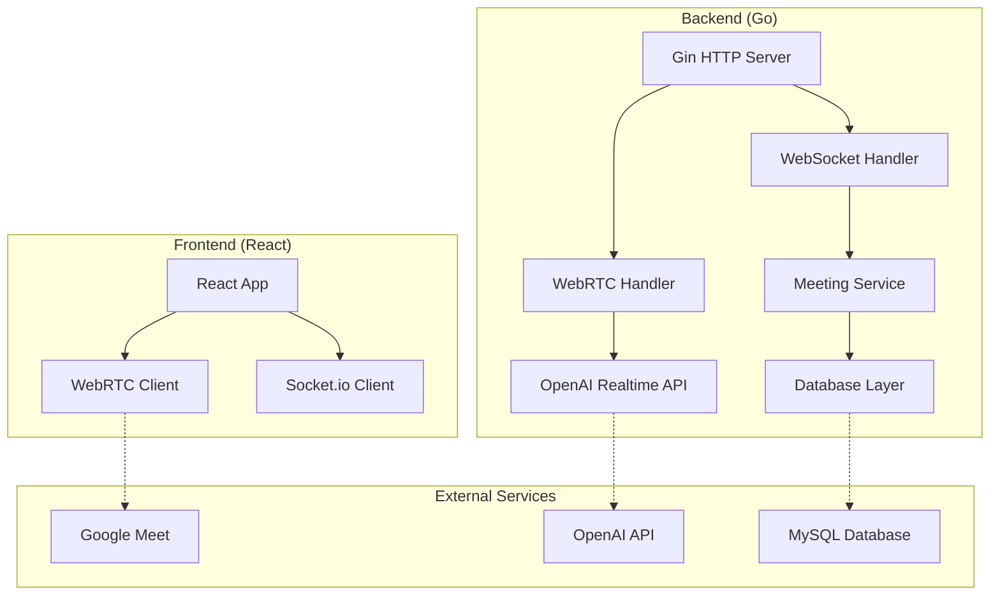

# WebRTC Agent Documentation

WebRTC-based AI agent for system development consultation へようこそ。

## 概要

本プロジェクトは、Google Meet に参加して AI エージェントがシステム開発相談を行い、要件定義書や機能仕様書を自動生成する WebRTC ベースのアプリケーションです。

## 主な機能

- **WebRTC通信**: Google Meet との real-time 接続
- **AI相談**: OpenAI Realtime API を活用した対話型相談
- **ドキュメント生成**: Mermaid/PlantUML を使った図表付きドキュメント
- **クリーンアーキテクチャ**: Go + React の分離構成

## 技術スタック

- **フロントエンド**: React + TypeScript + Vite
- **バックエンド**: Go + Gin フレームワーク
- **データベース**: MySQL + GORM
- **リアルタイム通信**: WebRTC (Pion) + WebSocket
- **AI**: OpenAI Realtime API
- **コンテナ**: Docker + Docker Bake
- **テスト**: Playwright E2E + BDD

## アーキテクチャ



## 開発開始

```bash
# リポジトリのクローン
git clone https://github.com/zawakichi/webrtc-agent.git
cd webrtc-agent

# 開発環境の起動
docker-compose -f environment/docker/docker-compose.dev.yml up

# アクセス
# フロントエンド: http://localhost
# バックエンドAPI: http://localhost/api
# ドキュメント: http://docs.localhost
```

## ドキュメント構成

- [アーキテクチャ](architecture/index.md): システム設計とアーキテクチャ
- [開発ガイド](development/index.md): 開発環境とワークフロー
- [API仕様](api/index.md): REST API と WebSocket API
- [デプロイ](deployment/index.md): Docker と Kubernetes デプロイ

## コントリビューション

プロジェクトへの貢献を歓迎します。詳細は [開発ガイド](development/workflow.md) をご覧ください。

## ライセンス

MIT License - 詳細は [LICENSE](https://github.com/zawakichi/webrtc-agent/blob/main/LICENSE) をご覧ください。