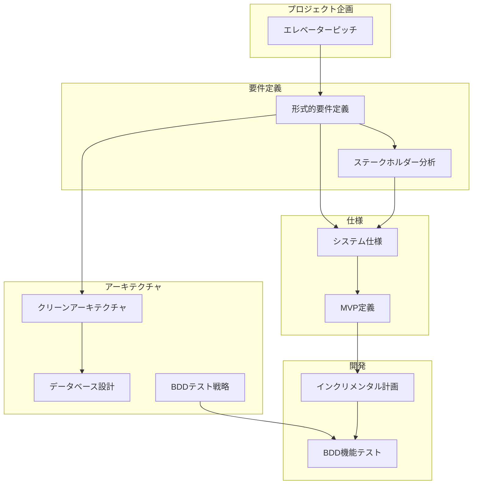
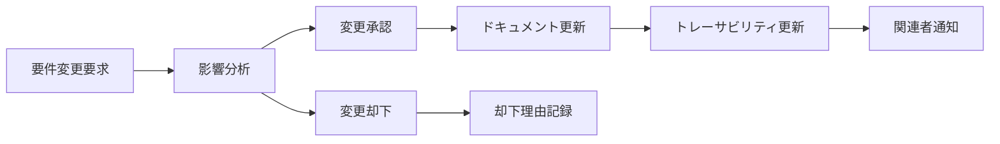

# WebRTC System Development Consultation Agent - トレーサビリティマトリックス

## 🔗 ドキュメント統合・整合性管理

### ドキュメント構造と相互関係

---

## 📊 要件トレーサビリティマトリックス

### ビジネス要件 → 機能要件 → 技術要件

| ビジネス要件ID | ビジネス要件名 | 機能要件ID | 機能要件名 | 技術要件ID | 技術要件名 | BDDシナリオ |
|---------------|-------------|-----------|----------|-----------|----------|-----------|
| **BR001** | 要件定義時間50%短縮 | FR001 | Google Meet参加 | TR001 | WebRTC統合 | 01-mvp-core.feature |
| **BR001** | 要件定義時間50%短縮 | FR002 | AI音声対話 | TR002 | OpenAI Realtime API | 01-mvp-core.feature |
| **BR002** | 要件品質向上 | FR003 | 構造化ヒアリング | TR003 | 要件分析エンジン | 02-basic-requirements.feature |
| **BR002** | 要件品質向上 | FR004 | 文書自動生成 | TR004 | テンプレートエンジン | 02-basic-requirements.feature |
| **BR003** | 運用コスト削減 | FR005 | 自動セッション管理 | TR005 | セッション監視システム | 01-mvp-core.feature |
| **BR004** | スケーラビリティ | FR006 | 複数同時セッション | TR006 | 負荷分散アーキテクチャ | 03-advanced-features.feature |
| **BR005** | セキュリティ確保 | FR007 | データ保護 | TR007 | 暗号化・アクセス制御 | All features |

### 非機能要件トレーサビリティ

| NFR要件ID | NFR要件名 | 対象システム | 実装方法 | 検証方法 | BDDシナリオ |
|----------|----------|-----------|---------|---------|-----------|
| **NFR001** | レスポンス時間≤2秒 | AI応答システム | 最適化アルゴリズム | 性能テスト | @mvp @technical @performance |
| **NFR002** | 稼働率≥99% | システム全体 | 冗長化・監視 | 可用性テスト | @increment3 @technical |
| **NFR003** | 同時100セッション | セッション管理 | スケーラブル設計 | 負荷テスト | @increment3 @advanced @scalability |
| **NFR004** | セキュリティ準拠 | データ処理 | 暗号化・監査 | セキュリティテスト | @mvp @security @data-protection |
| **NFR005** | 音声認識精度≥85% | 音声処理 | AI最適化 | 精度測定テスト | @mvp @core @audio-quality |

---

## 🎯 ステークホルダー要求 → システム機能マッピング

### プライマリーステークホルダー要求マッピング

#### 開発チーム要求
| ステークホルダー要求 | システム機能 | 実装優先度 | 担当アーキテクチャ層 |
|-------------------|-----------|----------|------------------|
| Clean Architecture実装 | モジュラー設計 | Must Have | 全層 |
| 自動テスト環境 | CI/CDパイプライン | Must Have | インフラ層 |
| 技術負債最小化 | コード品質管理 | Should Have | 全層 |

#### プロダクトオーナー要求
| ステークホルダー要求 | システム機能 | 実装優先度 | ビジネス価値 |
|-------------------|-----------|----------|-------------|
| MVP早期リリース | 基本機能セット | Must Have | 高 |
| 市場適合性検証 | ユーザーフィードバック | Must Have | 高 |
| ROI測定 | 効果測定機能 | Should Have | 中 |

#### エンドユーザー要求
| ユーザー種別 | 要求内容 | 対応機能 | MVP対応 | 将来対応 |
|-------------|---------|---------|---------|---------|
| 中小SI会社PM | 要件ヒアリング効率化 | AI対話機能 | ✅ | - |
| 中小SI会社PM | 文書作成自動化 | 文書生成機能 | 部分的 | ✅ |
| スタートアップCTO | 技術選定支援 | 推奨エンジン | - | ✅ |
| 大手企業情シス | エンタープライズ対応 | 認証・権限管理 | - | ✅ |

---

## 📐 形式的要件 → 実装仕様マッピング

### システム状態と実装

| 形式的状態定義 | Go実装コンポーネント | データベーステーブル | APIエンドポイント |
|-------------|------------------|------------------|-----------------|
| `Meeting` | `internal/domain/entities/meeting.go` | `meetings` | `POST /api/meetings` |
| `ConsultationSession` | `internal/domain/entities/consultation.go` | `consultation_sessions` | `POST /api/sessions` |
| `AIAgent` | `internal/app/services/ai_agent.go` | `ai_agents` | `GET /api/agents/{id}` |
| `AudioConnection` | `internal/infra/webrtc/connection.go` | - (メモリ管理) | WebSocket |

### 不変条件と実装

| 不変条件 | Go実装での検証 | テストカバレッジ |
|---------|-------------|---------------|
| INV1: 会議参加制約 | `ValidateAgentMeetingAssignment()` | TestMeetingConstraints |
| INV2: セッション整合性 | `ValidateSessionState()` | TestSessionConsistency |
| INV3: 音声接続制約 | `ValidateAudioQuality()` | TestAudioConstraints |
| INV4: 要件状態制約 | `ValidateRequirementStatus()` | TestRequirementValidation |
| INV5: エージェント制限 | `CheckAgentConcurrency()` | TestAgentLimits |

---

## 🔄 インクリメンタル開発と要件マッピング

### Increment 1: MVP Core
| 要件カテゴリ | 含まれる機能 | 除外される機能 | 成功基準 |
|-------------|-------------|-------------|---------|
| **機能要件** | Google Meet参加、基本AI対話 | 高度分析、複雑文書生成 | 参加成功率90%以上 |
| **非機能要件** | 基本性能、基本可用性 | 高可用性、スケーラビリティ | 応答時間2秒以内 |
| **技術要件** | WebRTC基盤、OpenAI統合 | 最適化、企業向け機能 | 技術実現可能性証明 |

### Increment 2: Basic Requirements
| 要件カテゴリ | 拡張機能 | 改善項目 | 成功基準 |
|-------------|---------|---------|---------|
| **機能要件** | 構造化ヒアリング、基本文書生成 | 要件分析精度 | 時間短縮70%達成 |
| **品質要件** | 自動テスト、品質監視 | バグ検出・修正 | 品質スコア85点以上 |
| **ユーザビリティ** | UI/UX改善、フィードバック | 使いやすさ向上 | CSAT 4.0以上 |

### Increment 3: Advanced Features
| 要件カテゴリ | 高度機能 | エンタープライズ対応 | 成功基準 |
|-------------|---------|-------------------|---------|
| **機能要件** | 高度分析、包括文書生成 | 複数システム対応 | エンタープライズ導入3社 |
| **非機能要件** | 高可用性、スケーラビリティ | セキュリティ強化 | 99.9%可用性 |
| **運用要件** | 監視、自動化 | サポート体制 | 運用負荷50%削減 |

---

## 📝 BDD仕様と要件の対応関係

### フィーチャーファイルと要件カバレッジ

#### 01-mvp-core.feature
| シナリオ | 対応ビジネス要件 | 対応機能要件 | 技術実装 |
|---------|-------------|------------|---------|
| Google Meet会議への基本参加 | BR001 | FR001 | WebRTCManager |
| 音声品質確認と基本応答 | BR001, BR002 | FR002 | AIAgent |
| 基本的な自己紹介と役割説明 | BR001 | FR002 | ConversationManager |

#### 02-basic-requirements.feature
| シナリオ | 対応ビジネス要件 | 対応機能要件 | 技術実装 |
|---------|-------------|------------|---------|
| 体系的な要件ヒアリングプロセス | BR002 | FR003 | RequirementAnalyzer |
| 機能要件の詳細分析 | BR002 | FR003 | FunctionalRequirementExtractor |
| 基本要件定義書の自動生成 | BR001, BR002 | FR004 | DocumentGenerator |

#### 03-advanced-features.feature
| シナリオ | 対応ビジネス要件 | 対応機能要件 | 技術実装 |
|---------|-------------|------------|---------|
| AI駆動の要件分析と提案 | BR002, BR004 | FR008 | AdvancedAnalyzer |
| 包括的リスク評価と対策立案 | BR002 | FR009 | RiskAssessmentEngine |
| システムアーキテクチャの自動設計 | BR004 | FR010 | ArchitectureDesigner |

---

## 🎛️ 設定管理・バージョン管理

### ドキュメントバージョン管理

| ドキュメント | バージョン | 最終更新 | レビュー状況 | 承認者 |
|-------------|----------|---------|-------------|--------|
| エレベーターピッチ | v1.0 | 2024-01-XX | 承認済み | Product Owner |
| 形式的要件定義 | v1.0 | 2024-01-XX | レビュー中 | Tech Lead |
| ステークホルダー分析 | v1.0 | 2024-01-XX | 承認済み | Project Manager |
| MVP定義 | v1.0 | 2024-01-XX | レビュー中 | Product Owner |
| インクリメンタル計画 | v1.0 | 2024-01-XX | 承認済み | Project Manager |

### 変更管理プロセス

### 品質管理チェックリスト

#### ドキュメント品質基準
- [ ] **完全性**: 必要な情報がすべて含まれている
- [ ] **一貫性**: 他ドキュメントとの整合性が取れている
- [ ] **明確性**: 曖昧な表現がない
- [ ] **追跡可能性**: 要件のトレーサビリティが確保されている
- [ ] **検証可能性**: テスト可能な形で記述されている

#### 技術文書品質基準
- [ ] **実装可能性**: 技術的に実現可能である
- [ ] **テスト可能性**: 検証可能な基準が設定されている
- [ ] **保守性**: 変更・拡張が容易である
- [ ] **セキュリティ**: セキュリティ要件が適切に考慮されている
- [ ] **性能**: 性能要件が定量的に定義されている

---

## 📈 継続的改善プロセス

### 定期レビュー・更新サイクル

#### 週次レビュー
- **対象**: 開発進捗と要件の整合性チェック
- **参加者**: 開発チーム、プロダクトオーナー
- **成果物**: 進捗レポート、課題・リスク一覧

#### 月次レビュー
- **対象**: 要件・仕様の妥当性検証
- **参加者**: 全ステークホルダー
- **成果物**: 要件変更提案、ドキュメント更新計画

#### 四半期レビュー
- **対象**: 戦略・方向性の見直し
- **参加者**: 経営陣、主要ステークホルダー
- **成果物**: 戦略調整、長期ロードマップ更新

### メトリクス・KPI監視

| メトリクス分類 | 測定項目 | 目標値 | 現在値 | トレンド |
|-------------|---------|-------|-------|--------|
| **文書品質** | 完全性スコア | 90%以上 | - | - |
| **トレーサビリティ** | 要件カバレッジ | 95%以上 | - | - |
| **変更管理** | 変更影響分析時間 | 4時間以内 | - | - |
| **ステークホルダー満足度** | レビュー満足度 | 4.0以上 | - | - |

このトレーサビリティマトリックスにより、プロジェクト全体の整合性を維持し、要件から実装まで一貫した品質を確保します。