# WebRTC System Development Consultation Agent - 形式的要件定義書

## 🎯 プロジェクトビジョン・目標

### ビジョンステートメント
**「AIエージェントによる自動要件定義で、システム開発プロセスを革新し、全ての開発者・企業が高品質なソフトウェアを効率的に創造できる世界を実現する」**

### ミッションステートメント
**「WebRTC技術とAIを融合し、リアルタイム音声対話による要件定義自動化プラットフォームを提供することで、システム開発の生産性と品質を飛躍的に向上させる」**

### 戦略目標
1. **効率性の革命**：要件定義期間の70%以上短縮
2. **品質の向上**：要件漏れ・齟齬の90%以上削減
3. **アクセシビリティ**：中小企業でも利用可能な価格・UX実現
4. **スケーラビリティ**：多言語・多業界対応のプラットフォーム構築

### 成功指標（KPI）
- **効率指標**：平均要件定義期間 2週間→3日以内
- **品質指標**：要件変更率 30%→5%以下
- **満足度指標**：NPS（Net Promoter Score）70点以上
- **経済指標**：顧客1社あたりのコスト削減効果 月100万円以上

---

## 📐 形式的システム定義

### システム状態の形式的定義

#### システム概要図
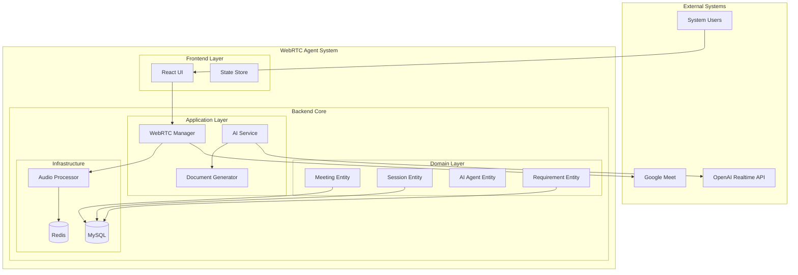

#### 基本型定義
```formal
// 基本型定義
USER_ID := String
MEETING_ID := String
SESSION_ID := String
TIMESTAMP := Integer
AUDIO_STREAM := Sequence(AudioFrame)
REQUIREMENT := Record(id: String, description: String, priority: Priority, status: Status)

// 列挙型
Priority ::= HIGH | MEDIUM | LOW
Status ::= DRAFT | REVIEWING | APPROVED | REJECTED
MeetingState ::= CONNECTING | CONNECTED | IN_SESSION | ENDED | ERROR
AgentState ::= IDLE | JOINING | ACTIVE | PROCESSING | RESPONDING

// 制約型
Port := {n: Integer | 1024 ≤ n ≤ 65535}
AudioQuality := {q: Real | 0.0 ≤ q ≤ 1.0}
ResponseTime := {t: Real | 0.0 ≤ t ≤ 5000.0} // milliseconds
```

#### データ構造関係図
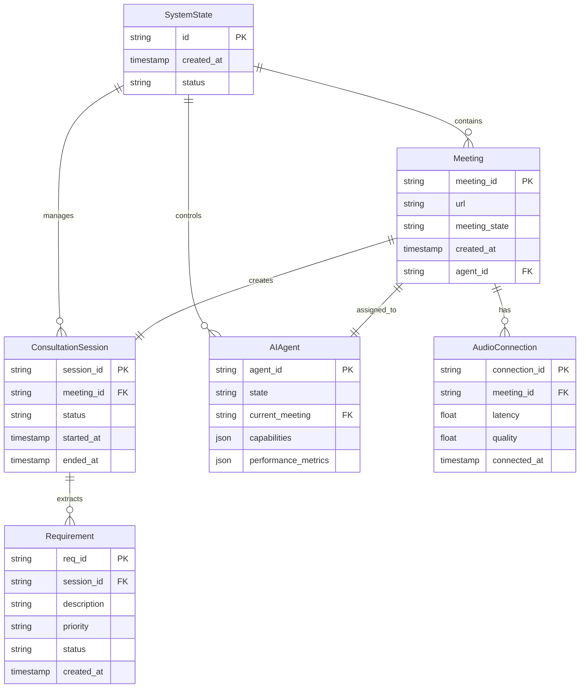

#### システム状態構造
```formal
SystemState ::= Record(
    meetings: Map(MEETING_ID, Meeting),
    sessions: Map(SESSION_ID, ConsultationSession),
    agents: Map(USER_ID, AIAgent),
    audio_connections: Map(MEETING_ID, AudioConnection),
    requirements: Map(SESSION_ID, Set(REQUIREMENT))
)

Meeting ::= Record(
    id: MEETING_ID,
    url: String,
    participants: Set(USER_ID),
    state: MeetingState,
    created_at: TIMESTAMP,
    agent_id: Optional(USER_ID)
)

ConsultationSession ::= Record(
    id: SESSION_ID,
    meeting_id: MEETING_ID,
    requirements: Set(REQUIREMENT),
    conversation_log: Sequence(ConversationEntry),
    documents: Set(GeneratedDocument),
    status: SessionStatus
)

AIAgent ::= Record(
    id: USER_ID,
    state: AgentState,
    current_meeting: Optional(MEETING_ID),
    capabilities: Set(Capability),
    performance_metrics: PerformanceMetrics
)
```

### システム不変条件（Invariants）

#### 基本不変条件
```formal
// INV1: 会議参加制約
∀ meeting ∈ meetings •
    meeting.agent_id ≠ null ⟹
    (∃ agent ∈ agents • agent.id = meeting.agent_id ∧ agent.current_meeting = meeting.id)

// INV2: セッション状態整合性
∀ session ∈ sessions •
    session.meeting_id ∈ dom(meetings) ∧
    meetings(session.meeting_id).state ∈ {CONNECTED, IN_SESSION}

// INV3: 音声接続制約
∀ connection ∈ audio_connections •
    connection.meeting_id ∈ dom(meetings) ∧
    meetings(connection.meeting_id).state ∈ {CONNECTED, IN_SESSION} ∧
    connection.latency ≤ 500 ∧  // 500ms以下
    connection.quality ≥ 0.8    // 品質80%以上

// INV4: 要件状態制約
∀ session ∈ sessions • ∀ req ∈ session.requirements •
    req.status = APPROVED ⟹ req.description ≠ "" ∧ req.priority ≠ null

// INV5: エージェント同時参加制限
∀ agent ∈ agents •
    agent.current_meeting ≠ null ⟹
    |{m ∈ meetings | m.agent_id = agent.id}| ≤ 1
```

#### セキュリティ不変条件
```formal
// SEC1: 音声データ永続化禁止
∀ audio_stream ∈ AUDIO_STREAM •
    ∃ expiry: TIMESTAMP • expiry ≤ current_time + 3600 ∧
    after(expiry) ⟹ audio_stream ∉ persistent_storage

// SEC2: 認証・認可チェック
∀ operation ∈ {JOIN_MEETING, CREATE_SESSION, GENERATE_DOCUMENT} •
    execute(operation) ⟹ authenticated(current_user) ∧ authorized(current_user, operation)
```

---

## 🔧 機能要件の論理的表現

### 機能要件全体構成図
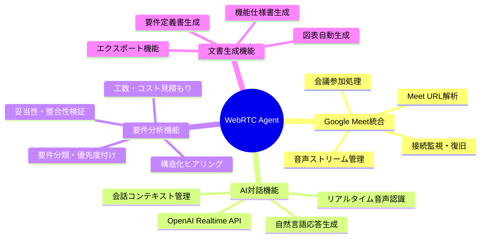

### 主要機能フロー
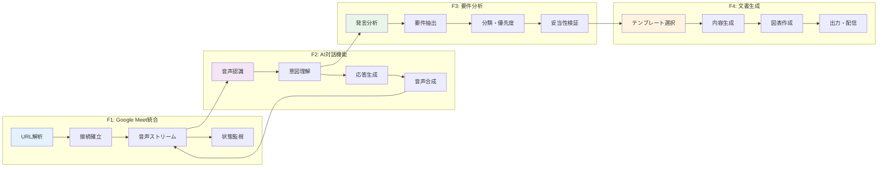

### 機能間相互作用図
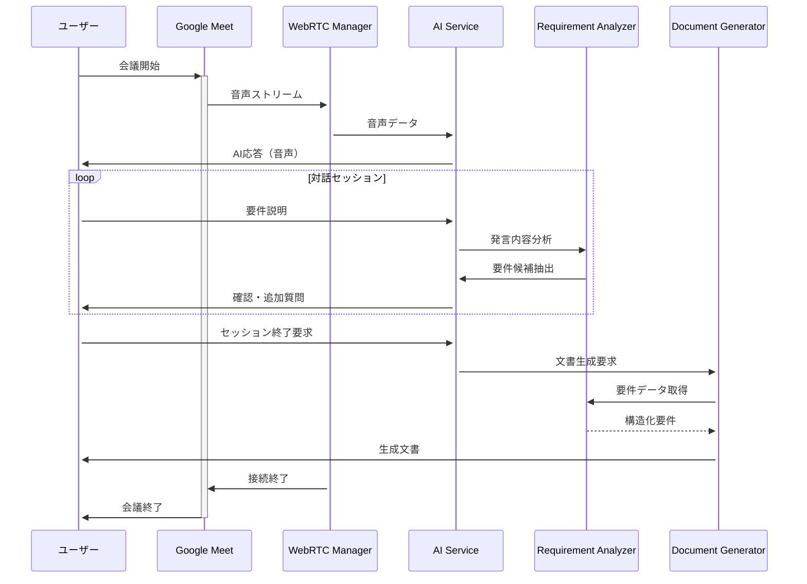

### 主要機能の事前条件・事後条件

#### F1: Google Meet参加機能
```formal
OPERATION: JoinMeeting(meeting_url: String, agent_id: USER_ID)

PRECONDITION:
    valid_url(meeting_url) ∧
    agent_id ∈ dom(agents) ∧
    agents(agent_id).state = IDLE ∧
    agents(agent_id).current_meeting = null

POSTCONDITION:
    ∃ meeting_id: MEETING_ID •
        meeting_id ∈ dom(meetings') ∧
        meetings'(meeting_id).url = meeting_url ∧
        meetings'(meeting_id).agent_id = agent_id ∧
        meetings'(meeting_id).state = CONNECTING ∧
        agents'(agent_id).state = JOINING ∧
        agents'(agent_id).current_meeting = meeting_id

EXCEPTION_CASES:
    ¬valid_url(meeting_url) ⟹ RAISE InvalidURLError
    agents(agent_id).state ≠ IDLE ⟹ RAISE AgentBusyError
```

#### F2: リアルタイム音声処理
```formal
OPERATION: ProcessAudioStream(meeting_id: MEETING_ID, audio_data: AUDIO_STREAM)

PRECONDITION:
    meeting_id ∈ dom(meetings) ∧
    meetings(meeting_id).state = IN_SESSION ∧
    |audio_data| > 0 ∧
    audio_data.quality ≥ 0.6

POSTCONDITION:
    ∃ processed_audio: AUDIO_STREAM •
        processed_audio.quality ≥ audio_data.quality ∧
        processed_audio.noise_level ≤ audio_data.noise_level * 0.3 ∧
        processed_audio.latency ≤ 100 // 100ms以下の処理遅延

EXCEPTION_CASES:
    audio_data.quality < 0.6 ⟹ RAISE LowAudioQualityError
    processing_time > 100 ⟹ RAISE ProcessingTimeoutError
```

#### F3: AI対話・要件抽出
```formal
OPERATION: ExtractRequirements(session_id: SESSION_ID, conversation: Sequence(ConversationEntry))

PRECONDITION:
    session_id ∈ dom(sessions) ∧
    sessions(session_id).status = ACTIVE ∧
    |conversation| > 0 ∧
    ∃ entry ∈ conversation • entry.speaker_type = USER

POSTCONDITION:
    ∃ requirements: Set(REQUIREMENT) •
        requirements ⊆ sessions'(session_id).requirements ∧
        |requirements| ≥ 1 ∧
        ∀ req ∈ requirements •
            req.description ≠ "" ∧
            req.priority ∈ {HIGH, MEDIUM, LOW} ∧
            req.status = DRAFT

QUALITY_CONSTRAINT:
    confidence_score(requirements) ≥ 0.8
```

#### F4: ドキュメント自動生成
```formal
OPERATION: GenerateRequirementDocument(session_id: SESSION_ID)

PRECONDITION:
    session_id ∈ dom(sessions) ∧
    |sessions(session_id).requirements| ≥ 1 ∧
    ∃ req ∈ sessions(session_id).requirements • req.status = APPROVED

POSTCONDITION:
    ∃ doc: GeneratedDocument •
        doc ∈ sessions'(session_id).documents ∧
        doc.type = REQUIREMENT_SPEC ∧
        doc.sections ⊇ {OVERVIEW, FUNCTIONAL_REQS, NON_FUNCTIONAL_REQS, DIAGRAMS} ∧
        doc.format ∈ {MARKDOWN, PDF} ∧
        doc.created_at = current_time

QUALITY_CONSTRAINT:
    completeness_score(doc) ≥ 0.9 ∧
    consistency_check(doc) = TRUE
```

---

## ⚡ 非機能要件の定量的基準

### 非機能要件概要図
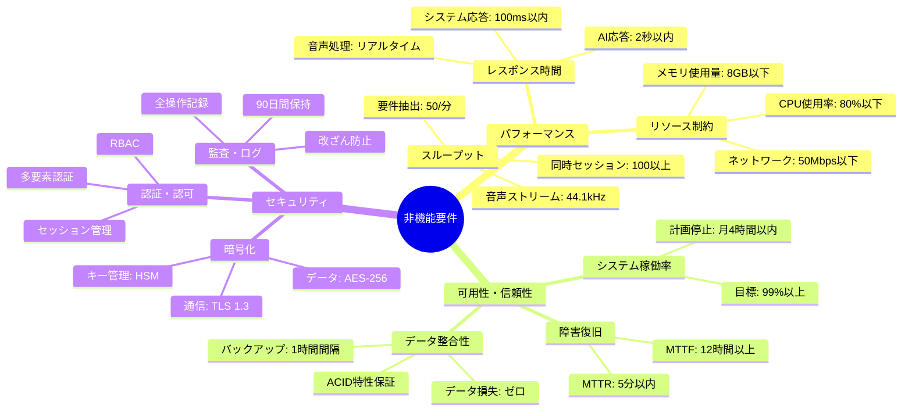

### パフォーマンス要件階層図
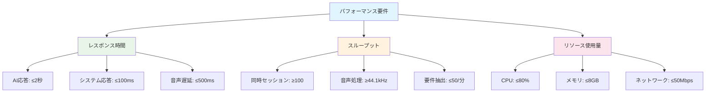

### セキュリティ要件レイヤー図
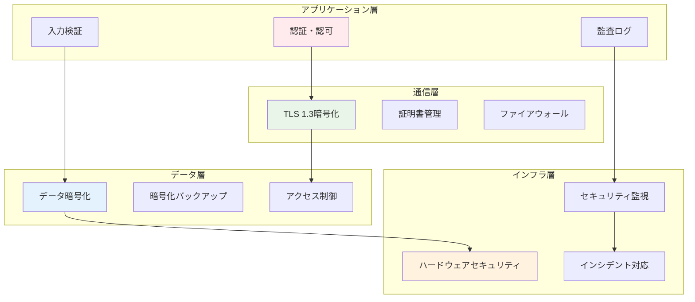

### 品質特性相関図
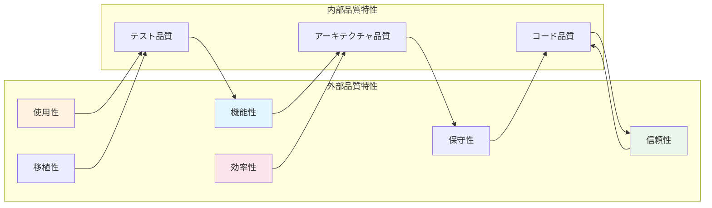

### パフォーマンス要件

#### P1: レスポンス時間制約
```formal
PERFORMANCE_REQUIREMENT_P1 := ∀ operation ∈ CRITICAL_OPERATIONS •
    response_time(operation) ≤ threshold(operation)

WHERE:
    CRITICAL_OPERATIONS := {JOIN_MEETING, PROCESS_AUDIO, AI_RESPONSE}
    threshold(JOIN_MEETING) := 10000  // 10秒
    threshold(PROCESS_AUDIO) := 100   // 100ms
    threshold(AI_RESPONSE) := 2000    // 2秒
```

#### P2: スループット制約
```formal
PERFORMANCE_REQUIREMENT_P2 :=
    concurrent_sessions ≤ 100 ∧
    audio_streams_per_second ≥ 44100 ∧
    requirement_extractions_per_minute ≤ 50
```

#### P3: リソース使用制約
```formal
RESOURCE_REQUIREMENT_P3 :=
    cpu_usage_percent ≤ 80 ∧
    memory_usage_gb ≤ 8 ∧
    network_bandwidth_mbps ≤ 50
```

### 可用性・信頼性要件

#### A1: システム稼働率
```formal
AVAILABILITY_REQUIREMENT_A1 :=
    uptime_percentage ≥ 99.0 ∧
    planned_downtime_per_month ≤ 4 // hours
```

#### A2: 障害復旧制約
```formal
RELIABILITY_REQUIREMENT_A2 :=
    MTTR ≤ 300 ∧  // Mean Time To Recovery: 5分以内
    MTTF ≥ 43200   // Mean Time To Failure: 12時間以上
```

#### A3: データ整合性
```formal
DATA_CONSISTENCY_A3 := ∀ transaction ∈ DATABASE_TRANSACTIONS •
    ACID_properties(transaction) = TRUE ∧
    backup_frequency ≤ 3600 ∧  // 1時間以内
    data_loss_tolerance = 0      // ゼロデータロス
```

### セキュリティ要件

#### S1: 暗号化制約
```formal
SECURITY_REQUIREMENT_S1 :=
    ∀ data ∈ SENSITIVE_DATA •
        encryption_in_transit(data) = TRUE ∧
        encryption_algorithm(data) ∈ {AES256, RSA2048} ∧
        key_rotation_frequency ≤ 86400  // 24時間以内
```

#### S2: 認証・認可制約
```formal
AUTH_REQUIREMENT_S2 :=
    ∀ user ∈ SYSTEM_USERS •
        authentication_method(user) ∈ {OAUTH2, SAML, MFA} ∧
        session_timeout ≤ 3600 ∧  // 1時間
        password_strength(user) ≥ 8  // エントロピー基準
```

#### S3: 監査ログ制約
```formal
AUDIT_REQUIREMENT_S3 :=
    ∀ critical_operation ∈ CRITICAL_OPERATIONS •
        logged(critical_operation) = TRUE ∧
        log_retention_days ≥ 90 ∧
        log_immutability = TRUE
```

---

## 🔄 状態遷移の形式的定義

### Meeting状態遷移図
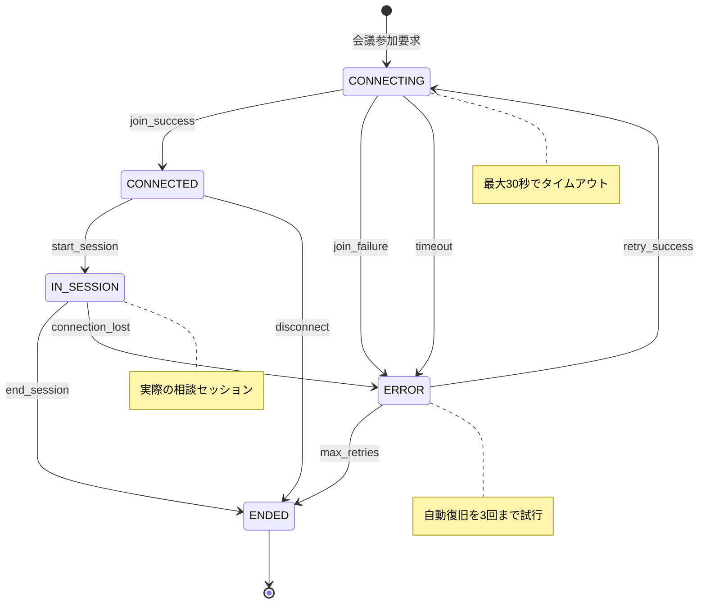

### Agent状態遷移図
```mermaid
stateDiagram-v2
    [*] --> IDLE : システム開始

    IDLE --> JOINING : join_meeting_request

    JOINING --> ACTIVE : join_success
    JOINING --> IDLE : join_failure

    ACTIVE --> PROCESSING : start_processing
    ACTIVE --> IDLE : end_session

    PROCESSING --> RESPONDING : generate_response
    PROCESSING --> ACTIVE : processing_timeout

    RESPONDING --> ACTIVE : response_sent
    RESPONDING --> PROCESSING : response_retry

    state ERROR_RECOVERY {
        ERROR_RECOVERY --> IDLE : recovery_complete
    }

    JOINING --> ERROR_RECOVERY : critical_error
    ACTIVE --> ERROR_RECOVERY : critical_error
    PROCESSING --> ERROR_RECOVERY : critical_error
    RESPONDING --> ERROR_RECOVERY : critical_error

    note right of IDLE : エージェント待機状態
    note right of PROCESSING : AI応答生成中（最大5秒）
    note right of ERROR_RECOVERY : 全エラーケースで安全にIDLEに戻る
```

### システム全体の状態遷移
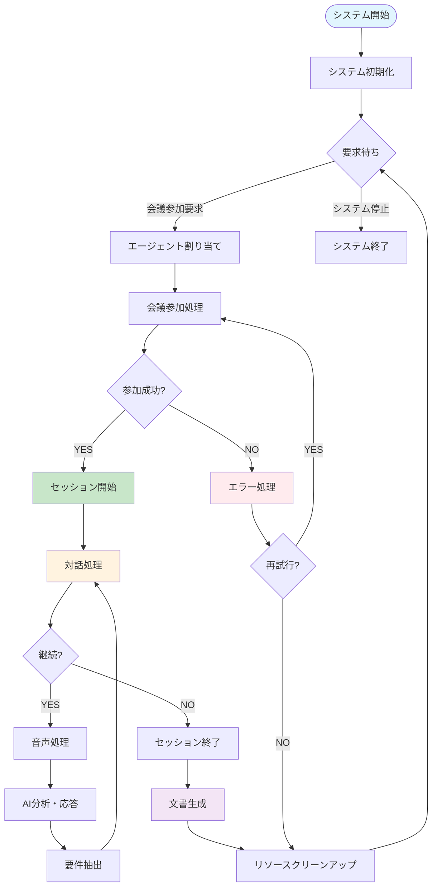

### Meeting状態遷移（形式定義）
```formal
MeetingStateTransition := {
    (CONNECTING, join_success) → CONNECTED,
    (CONNECTING, join_failure) → ERROR,
    (CONNECTING, timeout) → ERROR,
    (CONNECTED, start_session) → IN_SESSION,
    (CONNECTED, disconnect) → ENDED,
    (IN_SESSION, end_session) → ENDED,
    (IN_SESSION, connection_lost) → ERROR,
    (ERROR, retry_success) → CONNECTING,
    (ERROR, max_retries) → ENDED
}
```

### Agent状態遷移（形式定義）
```formal
AgentStateTransition := {
    (IDLE, join_meeting_request) → JOINING,
    (JOINING, join_success) → ACTIVE,
    (JOINING, join_failure) → IDLE,
    (ACTIVE, start_processing) → PROCESSING,
    (PROCESSING, generate_response) → RESPONDING,
    (RESPONDING, response_sent) → ACTIVE,
    (ACTIVE, end_session) → IDLE,
    (*, error_occurred) → IDLE  // 任意の状態からエラー時はIDLEに戻る
}
```

### 状態遷移制約
```formal
TRANSITION_CONSTRAINTS :=
    // TC1: 原子性制約
    ∀ transition ∈ StateTransitions •
        atomic(transition) = TRUE

    // TC2: 整合性制約
    ∀ state_change: (s1, event) → s2 •
        valid_transition(s1, event, s2) = TRUE

    // TC3: タイムアウト制約
    ∀ state ∈ {CONNECTING, PROCESSING} •
        time_in_state(state) ≤ max_timeout(state)
```

---

## 📊 品質特性の定量化

### 品質管理体系図
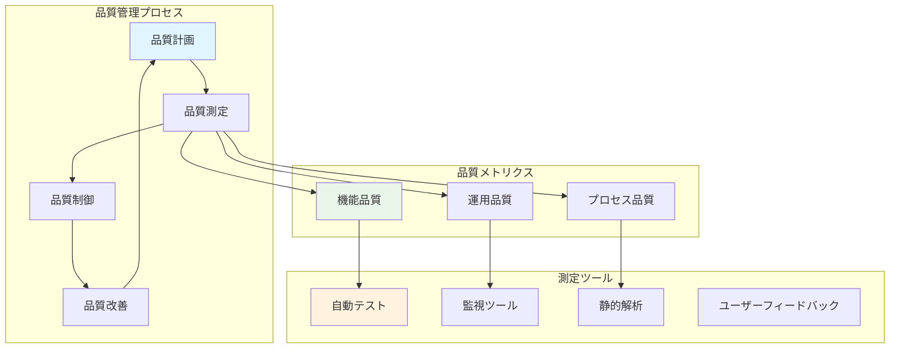

### 品質達成レベル図
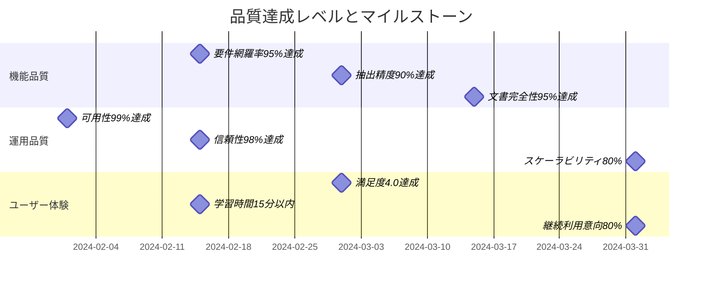

### 品質指標ダッシュボード設計
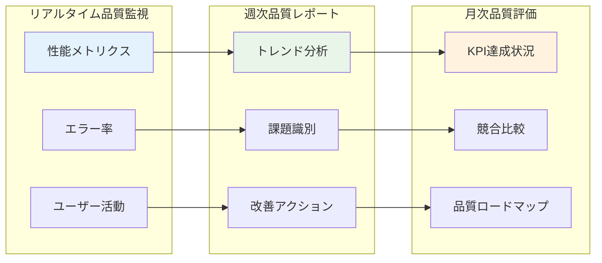

### 可測性基準（Measurability Criteria）

#### MC1: 機能品質指標
```formal
FUNCTIONAL_QUALITY := Record(
    requirement_coverage: Real,      // 要件網羅率
    extraction_accuracy: Real,       // 要件抽出精度
    document_completeness: Real,     // 文書完全性
    consistency_score: Real          // 一貫性スコア
)

WHERE:
    requirement_coverage ≥ 0.95 ∧    // 95%以上
    extraction_accuracy ≥ 0.90 ∧     // 90%以上
    document_completeness ≥ 0.95 ∧   // 95%以上
    consistency_score ≥ 0.85          // 85%以上
```

#### MC2: 運用品質指標
```formal
OPERATIONAL_QUALITY := Record(
    availability: Real,              // 可用性
    reliability: Real,               // 信頼性
    scalability: Real,              // スケーラビリティ
    maintainability: Real           // 保守性
)

WHERE:
    availability ≥ 0.99 ∧           // 99%以上
    reliability ≥ 0.98 ∧            // 98%以上
    scalability ≥ 0.80 ∧            // 80%以上（負荷増加対応）
    maintainability ≥ 0.85          // 85%以上（変更容易性）
```

### 受け入れ基準（Acceptance Criteria）

#### AC1: システム全体受け入れ基準
```formal
SYSTEM_ACCEPTANCE :=
    FUNCTIONAL_QUALITY.requirement_coverage ≥ 0.95 ∧
    FUNCTIONAL_QUALITY.extraction_accuracy ≥ 0.90 ∧
    OPERATIONAL_QUALITY.availability ≥ 0.99 ∧
    all_critical_scenarios_pass() = TRUE ∧
    security_audit_pass() = TRUE ∧
    performance_benchmarks_met() = TRUE

ACCEPTANCE_TEST_SUITE := {
    functional_tests: 500+,
    integration_tests: 200+,
    performance_tests: 100+,
    security_tests: 150+,
    usability_tests: 50+
}
```

---

## 📋 検証・妥当性確認

### 形式検証手法
1. **モデル検査（Model Checking）**
   - 状態遷移の網羅的検証
   - デッドロック・ライブロック検出
   - 安全性・活性特性の検証

2. **定理証明（Theorem Proving）**
   - 不変条件の数学的証明
   - 事前条件・事後条件の健全性証明
   - セキュリティ特性の形式的証明

3. **プロパティベーステスト**
   - 制約条件の自動テスト生成
   - 境界値・例外ケースの系統的検証
   - ランダム入力による頑健性テスト

### 妥当性確認プロセス
1. **ステークホルダー・レビュー**
2. **専門家による技術査読**
3. **プロトタイプによる概念実証**
4. **パイロット顧客による実証実験**

この形式的要件定義により、システムの曖昧さを排除し、実装・テスト・保守の各段階で一貫した品質を確保します。