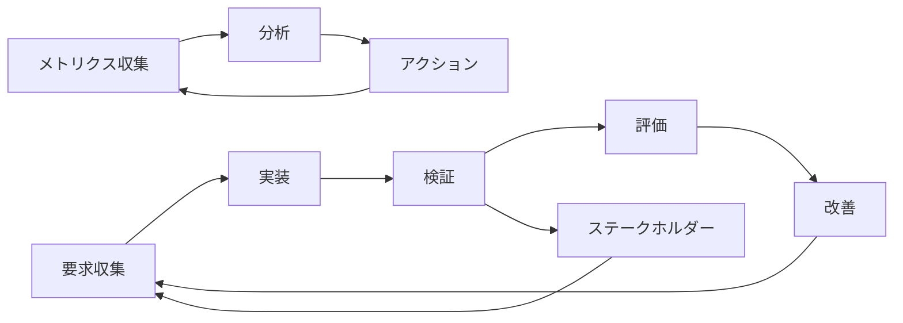

# WebRTC System Development Consultation Agent - ステークホルダー分析

## 🎯 ステークホルダー・マッピング

### 主要ステークホルダー分類

#### 内部ステークホルダー（Primary Stakeholders）

##### 1. 開発チーム（Development Team）
- **役割**：システム設計・開発・保守
- **関心事項**：
  - 技術アーキテクチャの健全性
  - 開発効率・保守性
  - コードの品質・テスト可能性
  - 技術負債の最小化
- **影響度**：高
- **関与度**：日常的
- **要求**：
  - 明確な技術仕様書
  - 実装可能なアーキテクチャ
  - 十分なテスト戦略
  - CI/CD環境の整備

##### 2. プロダクトオーナー（Product Owner）
- **役割**：プロダクトビジョン・戦略策定
- **関心事項**：
  - ビジネス価値の最大化
  - 市場適合性（Product-Market Fit）
  - 競合優位性の確保
  - ROI（投資対効果）
- **影響度**：最高
- **関与度**：戦略的
- **要求**：
  - 明確なビジネス要件
  - 機能優先度の定義
  - リリース計画・マイルストーン
  - 市場投入時期の最適化

##### 3. UX/UIデザイナー（UX/UI Designer）
- **役割**：ユーザー体験設計・インターフェース設計
- **関心事項**：
  - ユーザビリティの最適化
  - アクセシビリティ対応
  - デザイン一貫性
  - ユーザーフィードバックの反映
- **影響度**：高
- **関与度**：設計段階で集中的
- **要求**：
  - ユーザージャーニーマップ
  - ワイヤーフレーム・プロトタイプ
  - デザインシステム
  - ユーザビリティテスト計画

##### 4. QAエンジニア（QA Engineer）
- **役割**：品質保証・テスト戦略策定
- **関心事項**：
  - バグ・欠陥の未然防止
  - テスト自動化
  - 非機能要件の検証
  - リグレッション防止
- **影響度**：高
- **関与度**：開発全期間
- **要求**：
  - テスト可能な要件定義
  - 包括的テスト計画
  - 自動テスト環境
  - 品質メトリクス定義

---

#### 外部ステークホルダー（Secondary Stakeholders）

##### 5. エンドユーザー（End Users）

###### 5.1 システム開発会社
- **属性**：中小規模のシステムインテグレーター
- **課題**：
  - 要件定義工数の圧迫
  - 顧客との認識齟齬
  - ドキュメント作成負荷
  - 専門人材不足
- **期待**：
  - 要件定義期間の短縮（70%以上）
  - 要件品質の向上
  - ドキュメント作成自動化
  - コスト削減効果

###### 5.2 企業IT部門
- **属性**：大手企業・中堅企業の情報システム部門
- **課題**：
  - 社内要求の複雑化
  - IT投資対効果の測定困難
  - 外部ベンダー管理
  - デジタル変革への対応
- **期待**：
  - 要件の可視化・構造化
  - ステークホルダー間の合意形成支援
  - プロジェクト成功率向上
  - 投資判断材料の提供

###### 5.3 ITコンサルティング会社
- **属性**：戦略・業務・技術コンサルティング会社
- **課題**：
  - 顧客要求の高度化
  - 提案品質の差別化
  - プロジェクト成功率向上
  - ノウハウの標準化
- **期待**：
  - 高品質な要件定義支援
  - 顧客満足度向上
  - 提案力強化
  - 競合差別化

###### 5.4 スタートアップ企業
- **属性**：技術系スタートアップ・新規事業開発部門
- **課題**：
  - 限られたリソース
  - 迅速な仮説検証
  - 技術的知見不足
  - 投資家への説明責任
- **期待**：
  - 低コストでの要件定義
  - 迅速なプロトタイピング支援
  - 技術選定アドバイス
  - 投資判断材料作成

##### 6. システム管理者・運用チーム（System Administrators）
- **役割**：システム運用・保守・監視
- **関心事項**：
  - システム安定性
  - 監視・ログ管理
  - セキュリティ対策
  - 災害復旧計画
- **影響度**：中
- **関与度**：運用開始後継続的
- **要求**：
  - 運用手順書・マニュアル
  - 監視項目・アラート定義
  - セキュリティポリシー
  - バックアップ・復旧手順

##### 7. 法務・コンプライアンス部門（Legal & Compliance）
- **役割**：法的リスク管理・規制対応
- **関心事項**：
  - データ保護法対応（GDPR、個人情報保護法）
  - 利用規約・プライバシーポリシー
  - 知的財産権の保護
  - サービス利用規約
- **影響度**：中
- **関与度**：設計段階・リリース前
- **要求**：
  - プライバシー・バイ・デザイン
  - データ処理の透明性
  - 利用者同意取得プロセス
  - 監査証跡の確保

---

#### 規制・標準化機関（Regulatory Bodies）

##### 8. 技術標準化団体
- **組織**：W3C、IETF、ISO/IEC等
- **関心事項**：
  - WebRTC標準仕様準拠
  - セキュリティベストプラクティス
  - アクセシビリティ準拠
  - 相互運用性確保
- **影響度**：中
- **要求**：
  - 標準準拠の技術実装
  - セキュリティ監査対応
  - ドキュメント整備

##### 9. データ保護当局
- **組織**：個人情報保護委員会等
- **関心事項**：
  - 個人データの適切な処理
  - 利用者の権利保護
  - 国際データ転送規制
  - セキュリティ事故対応
- **影響度**：高
- **要求**：
  - プライバシー影響評価
  - データ処理記録の整備
  - 事故報告体制の確立
  - 利用者権利行使手続き

---

## 💼 ステークホルダー要求分析

### 機能要求マトリックス

| ステークホルダー | 高優先度要求 | 中優先度要求 | 低優先度要求 |
|------------------|-------------|-------------|-------------|
| **開発チーム** | ・Clean Architecture<br/>・自動テスト環境<br/>・CI/CD整備 | ・コード品質ツール<br/>・監視・ロギング<br/>・ドキュメント自動生成 | ・パフォーマンス最適化<br/>・技術負債管理 |
| **プロダクトオーナー** | ・MVP早期リリース<br/>・市場投入時期<br/>・ROI測定 | ・競合分析<br/>・ユーザーフィードバック収集<br/>・機能優先度管理 | ・国際化対応<br/>・多言語サポート |
| **エンドユーザー** | ・要件定義時間短縮<br/>・使いやすいUI<br/>・高い精度の要件抽出 | ・多様な会議システム対応<br/>・カスタマイズ機能<br/>・サポート体制 | ・モバイル対応<br/>・オフライン機能 |
| **システム管理者** | ・システム監視<br/>・ログ管理<br/>・セキュリティ対策 | ・自動バックアップ<br/>・障害復旧手順<br/>・容量計画 | ・性能チューニング<br/>・コスト最適化 |
| **法務・コンプライアンス** | ・データ保護対応<br/>・プライバシー確保<br/>・利用規約整備 | ・監査証跡<br/>・事故対応手順<br/>・規制対応文書 | ・知的財産権保護<br/>・契約管理 |

### 利害対立・調整点

#### 対立1：パフォーマンス vs セキュリティ
- **対立内容**：高速レスポンス要求 vs 厳格なセキュリティチェック
- **影響者**：開発チーム（パフォーマンス重視）vs 法務（セキュリティ重視）
- **調整策**：
  - 段階的セキュリティ実装
  - パフォーマンス指標とセキュリティレベルのバランス
  - リスクベースアプローチ採用

#### 対立2：機能豊富 vs シンプル性
- **対立内容**：多機能化要求 vs 使いやすさ重視
- **影響者**：プロダクトオーナー（機能拡張）vs UXデザイナー（シンプル性）
- **調整策**：
  - MVP→基本機能→高度機能の段階リリース
  - ユーザー群別機能提供
  - 設定・カスタマイズ機能による選択肢提供

#### 対立3：迅速開発 vs 品質確保
- **対立内容**：早期リリース圧力 vs 十分な品質検証
- **影響者**：プロダクトオーナー（速度）vs QAエンジニア（品質）
- **調整策**：
  - 自動テスト環境の早期構築
  - 継続的品質監視
  - 品質ゲート設定

---

## 🎯 ステークホルダー・エンゲージメント戦略

### コミュニケーション計画

#### 1. 定期ミーティング体系
- **Weekly Sprint Review**：開発チーム・プロダクトオーナー・UX
- **Bi-weekly Stakeholder Update**：全ステークホルダー向け進捗報告
- **Monthly Business Review**：プロダクトオーナー・経営陣向け
- **Quarterly Strategy Review**：戦略・ロードマップ見直し

#### 2. コミュニケーションツール・チャネル
- **Slack**：日常的コミュニケーション
- **Jira/GitHub Issues**：要求管理・バグ追跡
- **Confluence/Notion**：ドキュメント共有
- **Zoom/Meet**：定期ミーティング・デモ
- **Email**：公式通知・承認依頼

#### 3. 情報共有レベル
```
┌─────────────────┬─────────────────┬─────────────────┐
│   機密レベル    │    対象者       │    共有内容     │
├─────────────────┼─────────────────┼─────────────────┤
│     Public      │   全員          │ 基本情報・FAQ   │
│   Internal      │ 社内関係者      │ 開発進捗・仕様  │
│ Confidential    │ コア開発チーム  │ 技術詳細・課題  │
│    Secret       │ 経営陣のみ      │ 戦略・財務情報  │
└─────────────────┴─────────────────┴─────────────────┘
```

### 意思決定プロセス

#### 1. RACI（責任分担）マトリックス

| 決定事項 | プロダクトオーナー | 開発チーム | UXデザイナー | QAエンジニア |
|----------|-------------------|------------|-------------|-------------|
| **機能要求優先度** | A | C | C | I |
| **技術アーキテクチャ** | C | A | I | C |
| **UI/UX設計** | C | I | A | C |
| **品質基準** | C | C | I | A |
| **リリース判定** | A | C | C | C |

**凡例**: A=Accountable（実行責任）、R=Responsible（実行）、C=Consulted（協議）、I=Informed（報告）

#### 2. 合意形成プロセス
1. **提案段階**：関係者による要求・提案
2. **検討段階**：技術的検証・影響分析
3. **協議段階**：ステークホルダー間協議・調整
4. **決定段階**：最終意思決定・承認
5. **実行段階**：実装・展開
6. **評価段階**：結果検証・フィードバック

### リスク・課題管理

#### 1. ステークホルダーリスク

| リスク | 影響度 | 発生確率 | 対策 |
|--------|--------|----------|------|
| **要求仕様の頻繁変更** | 高 | 中 | ・変更管理プロセス厳格化<br/>・影響分析の義務化 |
| **技術的実現困難性** | 高 | 低 | ・早期プロトタイピング<br/>・技術検証の前倒し |
| **市場投入時期遅延** | 中 | 中 | ・段階リリース計画<br/>・MVP優先実装 |
| **品質問題発生** | 高 | 低 | ・継続的品質監視<br/>・自動テスト強化 |
| **法規制対応遅延** | 中 | 低 | ・早期法務相談<br/>・規制動向監視 |

#### 2. 課題エスカレーション
1. **Level 1**：開発チーム内で解決
2. **Level 2**：プロダクトオーナー判断
3. **Level 3**：ステークホルダー会議
4. **Level 4**：経営陣判断

---

## 📊 成功指標・KPI

### ステークホルダー満足度指標

#### 1. 定量指標
- **顧客満足度（CSAT）**：目標85点以上
- **Net Promoter Score（NPS）**：目標70点以上
- **要求変更率**：目標10%以下
- **プロジェクト遅延率**：目標5%以下

#### 2. 定性指標
- **ステークホルダー・フィードバック**：四半期調査
- **チーム・モラル調査**：月次実施
- **品質満足度評価**：リリース毎
- **サポート満足度**：継続測定

### 継続的改善プロセス

#### 1. フィードバックループ


#### 2. 改善活動
- **月次レトロスペクティブ**：チーム内改善
- **四半期ステークホルダー・レビュー**：関係者フィードバック
- **年次戦略見直し**：長期方向性調整
- **継続的学習**：技術・市場動向キャッチアップ

この包括的なステークホルダー分析により、プロジェクトの成功確率を最大化し、全関係者の期待に応える高品質なシステムを構築します。